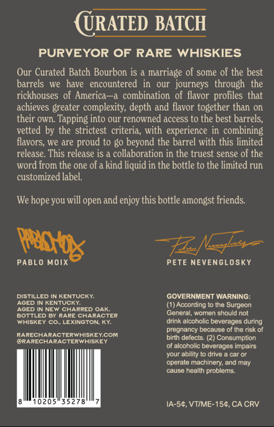
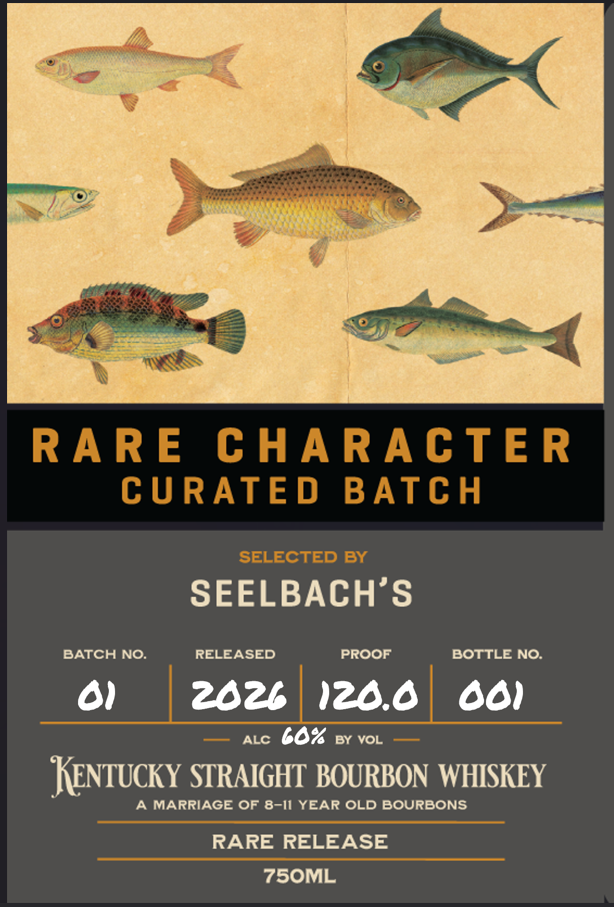

# TTB COLA Label Images - TTBID 26216001000439

**Brand Name:** RARE CHARACTER WHISKEY

**Fanciful Name:** RARE RELEASE

**Issue Date:** 08/11/2026

**Origin Code:** 22

**Product Class/Type:** 101

**Source:** [TTB Public COLA Registry](https://ttbonline.gov/colasonline/viewColaDetails.do?action=publicFormDisplay&ttbid=26216001000439)

## Label Images

### Back Label

### Label 1

## Extracted Label Text

*Text extracted via OCR - may contain errors*

### Back Label

URATED BATCH
PURVEYOR OF RARE WHISKIES
Our Curated Batch Bourbon is a marriage of some of the best
barrels we   have   encountered   in
our   journeys   through the
rickhouses of America
combination  of flavor profiles that
achieves greater complexity; depth and flavor together than on
their own. Tapping into our renowned access to the best barrels;
vetted by the strictest criteria, with  experience in combining
flavors; we are proud to go beyond the barrel with this limited
release. This release is a collaboration in the truest sense of the
word from the one of a kind liquid in the bottle to the limited run
customized label:
We
you will open and enjoy this bottle amongst friends:
PABLO Moix
PETE nEVEnGLOSKY
DISTILLED IN KENTUCKY:
GOVERNMENT WARNING:
AGED IN KENTUCKY:
(1) According to the Surgeon
AGED IN NEW CHARRED OAK:
BOTTLED By RARE CHARACTER
General, women should not
WHISKEY CO. LEXINGTON; KY:
drink alcoholic beverages during
pregnancy because of the risk of
RARECHARACTERWHISKEYCOM
birth defects_
Consumption
ORARECHARACTERWHISKEY
of alcoholic beverages impairs
your ability t0 drive
car Or
operate machinery;
may
cause health problems.
205
35278
IA-5c, VTIME-154, CA CRV
hope -
pab
and

### Label 1

RARE
C HARACTE R
CURATE D
BATCH
SELECTED BY
SEELBACH'S
BATCH NO.
RELEASED
PROOF
BOTTLE NO:
202b
120.0
001
ALC
607
BY VOL
Kentucky STRAIGHT BOURBON WHISKEY
MARRIAGE OF 8-I1 YEAR OLD BOURBONS
RARE RELEASE
75OML
