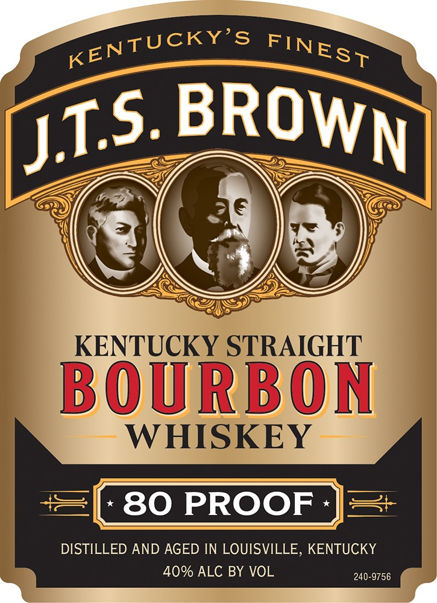
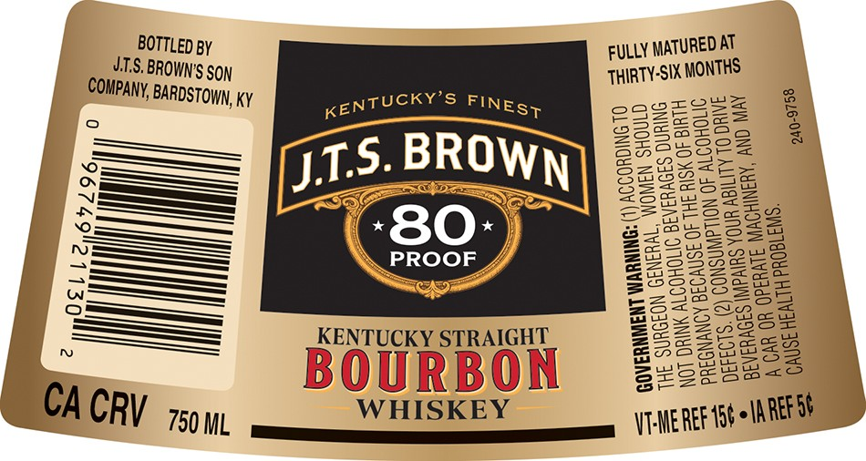

# TTB COLA Label Images - TTBID 26216001000493

**Brand Name:** J.T.S. BROWN

**Issue Date:** 08/12/2026

**Origin Code:** 22

**Product Class/Type:** 101

**Source:** [TTB Public COLA Registry](https://ttbonline.gov/colasonline/viewColaDetails.do?action=publicFormDisplay&ttbid=26216001000493)

## Label Images

### Label 1

### Label 2

## Extracted Label Text

*Text extracted via OCR - may contain errors*

**Detected Proof:** 80

### Label 1

KENTUCKY STRAIGHT
BOURBON
WHISKEY
80 PROOF
DISTILLED AND AGED IN LOUISVILLE, KENTUCKY
40% ALC BY VOL
240-9756
KENTUCKY'S
FINEST
BROWN
JIS:

### Label 2

BOTTLED BY

FULLY MATURED AT

UTS. BROWN'S SoN

THIRTY-SIX MONTH

COMPANY, BARDSTOWN, Ky

KENTUCKY'S FINES;

cosees

BSeees=

SeSazss

S505

BASCSSoE=

—>=>=

——

Se

j1.5

sa

BROW

oaee

SS2ea

wos

62

———

S5u

=> ESeae

B25Sm

we

——_—_

-80-

2H So me

C=

—$<_$_>

PROOF 4

255a

Z223eS32ee2

Sa222Z2eu

CAs

So

Secs

CSes

Se

—H——_—

———

Ez

222aa

ance

aw

————==

S2le

SeZZa

See

Sox

—————

KENTUCKY STRAIGHT

BAG

S2S5a

aw

azz)

Ss2e=e

S62

Bac

BOURBON

Sx

WHISKEY

CAC

750 ML

ri AER tt eARET SP
