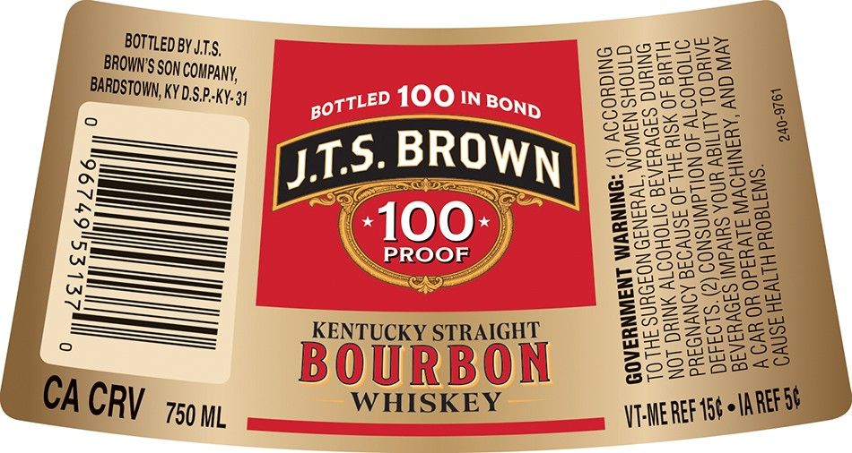
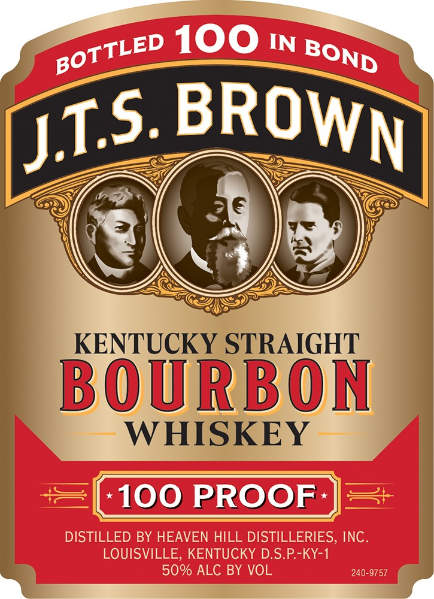

# TTB COLA Label Images - TTBID 26216001000499

**Brand Name:** J.T.S. BROWN

**Fanciful Name:** BOTTLED IN BOND

**Issue Date:** 08/11/2026

**Origin Code:** 22

**Product Class/Type:** 101

**Source:** [TTB Public COLA Registry](https://ttbonline.gov/colasonline/viewColaDetails.do?action=publicFormDisplay&ttbid=26216001000499)

## Label Images

### Back Label

### Label 1

## Extracted Label Text

*Text extracted via OCR - may contain errors*

**Detected Proof:** 100

### Back Label

BOTTLED BYJ.T5,

act

ows

oS

BROWN'S So

ZaZz

255

ea)

aS

W COMPANY,

[=xe)

BECo

BARDSTOWN, K

YD.S.P-KY¥-34

On

craw OoZ

Cora

OZR

ow

Zoe

Baez

t2anc

woo

20

—__=>=

—_—.

SurZ

az

ate

st

5. BROWN

=

<2

———

ras

a2nue2eSs

S=>=

7

“leve

250u

223555008

S-2a

———_—=

00°)

$6

S2eESea

S29eee

———

ROOF

325068

wo

wt

ESS

6t> nose

2 oy

)w

_———

=<c

SSS

25

2222

BZAi86=

—>

KENTUCKY STRAIGHT

-sy

Zoe

euwaS

(

See

GuSonm

ow

mao

BOURBON

WHISKEY

CA CR V 750 ML

VE-MEREE ‘pte lA REESE

### Label 1

100
IN
KENTUCKY STRAIGHT
BOURBON
WHISKEY
100 PROOF
DISTILLED BY HEAVEN HILL DISTILLERIES, INC.
LOUISVILLE, KENTUCKY DS.P-KY-1
50% ALC BY VOL
240-9757
BOTTLED
BOND
BROWN
JIS.
