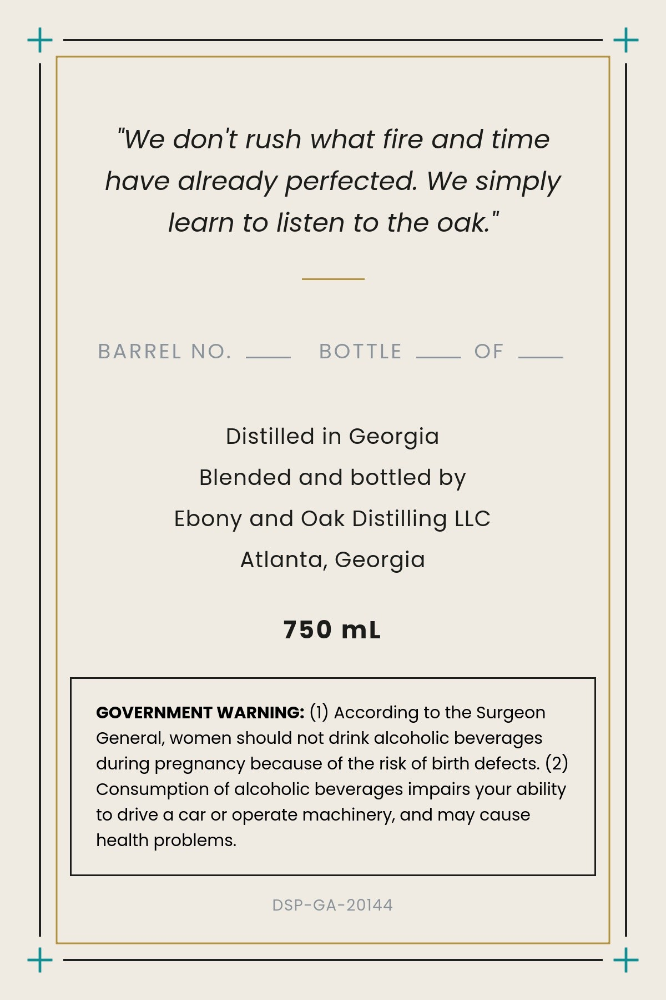
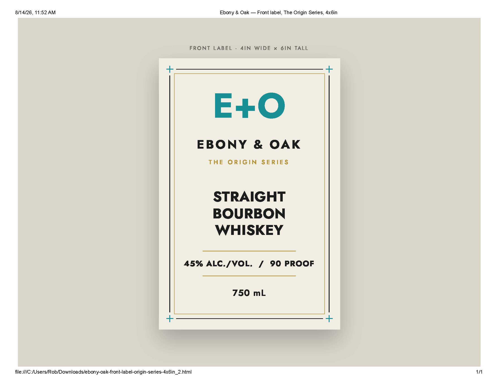

# TTB COLA Label Images - TTBID 26216001000511

**Brand Name:** EBONY & OAK

**Issue Date:** 08/17/2026

**Origin Code:** 08

**Product Class/Type:** 101

**Source:** [TTB Public COLA Registry](https://ttbonline.gov/colasonline/viewColaDetails.do?action=publicFormDisplay&ttbid=26216001000511)

## Label Images

### Back Label

### Front Label

## Extracted Label Text

*Text extracted via OCR - may contain errors*

**Detected Proof:** 90

### Back Label

+
don't rush what fire and time
have
already perfected: We simply
learn to listen to the oak
BARREL
NO.
BOTTLE
OF
Distilled in Georgia
Blended and bottled by
Ebony and Oak Distilling LLC
Atlanta, Georgia
750 mL
GOVERNMENT WARNING: (1) According to the Surgeon
General, women should not drink alcoholic beverages
during pregnancy because of the risk of birth defects: (2)
Consumption of alcoholic beverages impairs your ability
to drive a car or operate machinery, and may cause
health problems
DSP-GA-20144
"We

### Front Label

8/14/26, 11.52AM
Ebony & Oak
Front label, The Origin Series, 4x6in
FRONT LABEL
4IN WIDE
x 6IN TALL
E+0
EBONY
&
OAK
THE
ORIGIN
SERIE $
STRAIGHT
BOURBON
WHISKEY
45% ALC-/VOL:
90 PROOF
750 mL
file IIIC IUsers/Rob/Downloadslebony-oak-front-label-origin-series-4x6in_2.html
1/1
