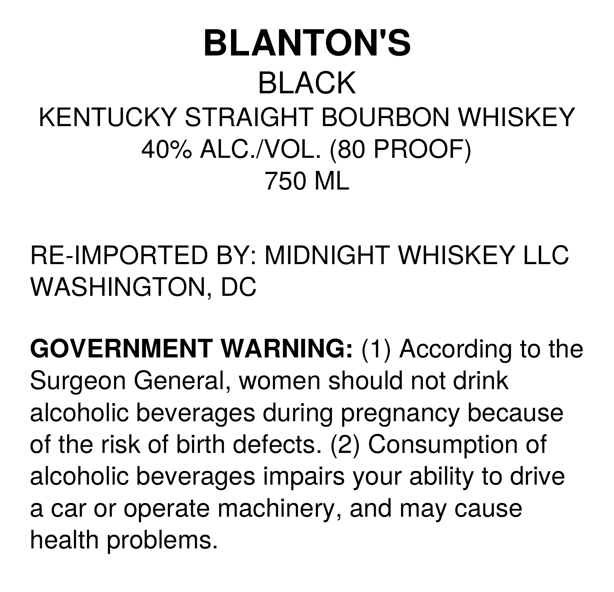
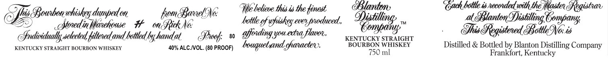
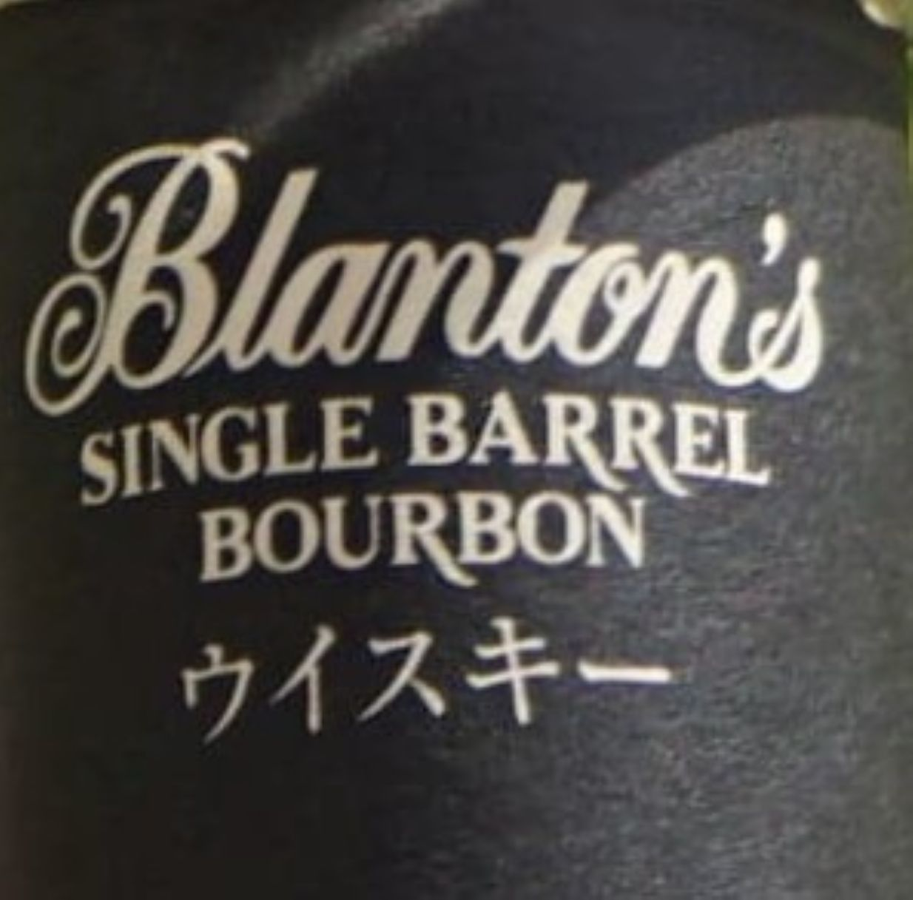

# TTB COLA Label Images - TTBID 26216001000565

**Brand Name:** BLANTON

**Issue Date:** 08/13/2026

**Origin Code:** 4K

**Product Class/Type:** 101

**Source:** [TTB Public COLA Registry](https://ttbonline.gov/colasonline/viewColaDetails.do?action=publicFormDisplay&ttbid=26216001000565)

## Label Images

### Back Label

### Label 1

### Label 2

## Extracted Label Text

*Text extracted via OCR - may contain errors*

*1 image(s) excluded: text did not meet readability threshold*

**Detected Proof:** 80

### Back Label

BLANTON'S
BLACK
KENTUCKY STRAIGHT BOURBON WHISKEY
40% ALC NOL. (80 PROOF)
750 ML
RE-IMPORTED BY: MIDNIGHT WHISKEY LLC
WASHINGTON, DC
GOVERNMENT WARNING: (1) According to the
Surgeon General,
women should not drink
alcoholic beverages during pregnancy because
of the risk of birth defects. (2) Consumption of
alcoholic beverages impairs your ability to drive
a car or
operate machinery,
J
and may cause
health problems.

### Label 1

Blanton,

wbon

fomBanelNo:

We believe. this is the finest

Cndh hotles necorted with the Mlgsten Fegistrar

Horedinlfrekowe H mRihNe

whiskey dumped mn

Aottle of upiskey ever produced,

Ci ta

Fe a aa a

Sraividually selected filered and batted by handat

Prof Yfording youedra flavor,

KENTUCKY STRAIGHT

BOURBON WHISKEY

Distilled & Bottled by Blanton Distilling Company

KENTUCKY STRAIGHT BOURBON WHISKEY

40% ALC.VOL. (80 PROOF) bouguelvand character 2

750 ml

Frankfort, Kentucky
