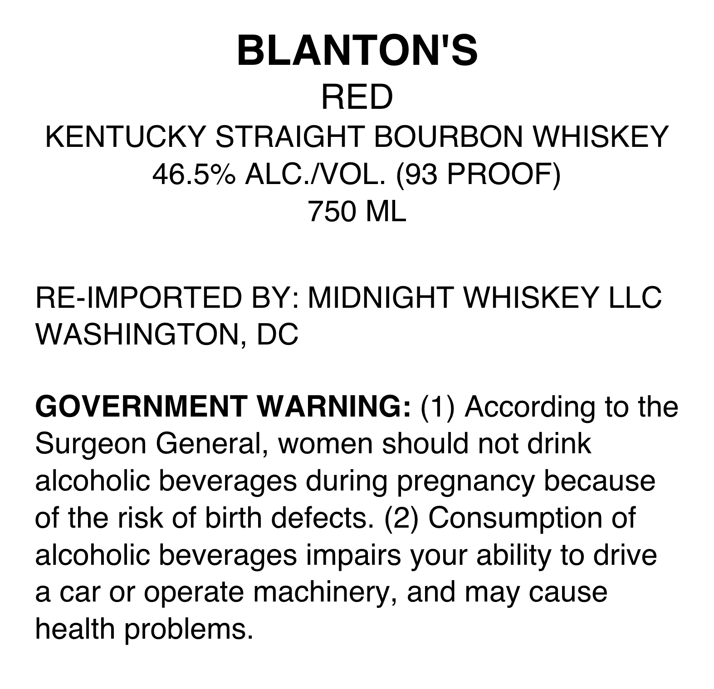
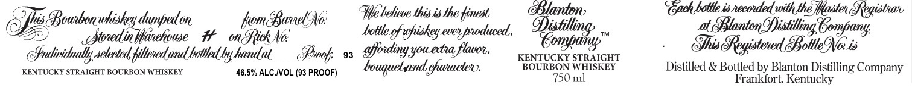
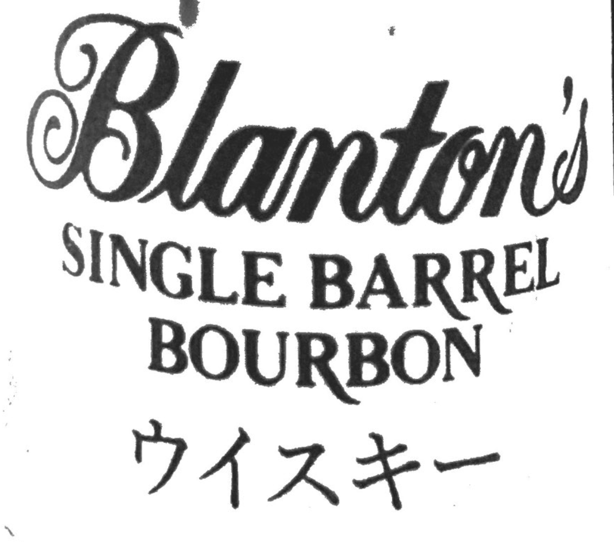

# TTB COLA Label Images - TTBID 26216001000570

**Brand Name:** BLANTON

**Issue Date:** 08/11/2026

**Origin Code:** 4K

**Product Class/Type:** 101

**Source:** [TTB Public COLA Registry](https://ttbonline.gov/colasonline/viewColaDetails.do?action=publicFormDisplay&ttbid=26216001000570)

## Label Images

### Back Label

### Label 1

### Label 2

## Extracted Label Text

*Text extracted via OCR - may contain errors*

**Detected Proof:** 93

### Back Label

BLANTONS
RED
KENTUCKY STRAIGHT BOURBON WHISKEY
46.5% ALC NOL. (93 PROOF)
750 ML
RE-IMPORTED BY: MIDNIGHT WHISKEY LLC
WASHINGTON, DC
GOVERNMENT WARNING: (1) According to the
Surgeon General, women should not drink
alcoholic beverages during pregnancy because
of the risk of birth defects: (2) Consumption of
alcoholic beverages impairs your ability to drive
a car or
operate machinery, and may cause
health problems:

### Label 1

F 4 CIWON Sh he Cad bollle i led with the, CD ns:
Sfhis Bowbonwhishey dunpedon from Barnel(yoe — Webel tists the finest 5) kanton, Blanton Pua ili Registrar
BS” india Wrckowe Hm SRiehe biblog) files Te feed. Corsi” Fa Regiined Beis

Snvidaally selected filtered and bottled by handat Prof, os GPeiding you edra, z KENTUCKY STRAIGHT 40.3 ee
KENTUCKY STRAIGHT BOURBON WHISKEY aes%arcwvoL(esPRoor) — Aeuguuelvaned, characters. BouniON WHISKEY Distilled & Boted by Parton Distiling Company

### Label 2

Blanton
SINGLE BARREL
BOURBON
— DARE
