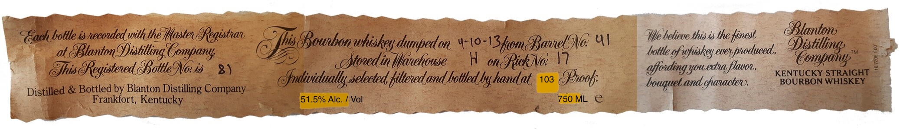
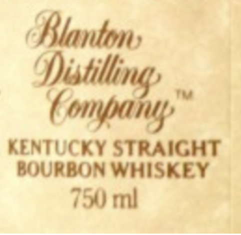
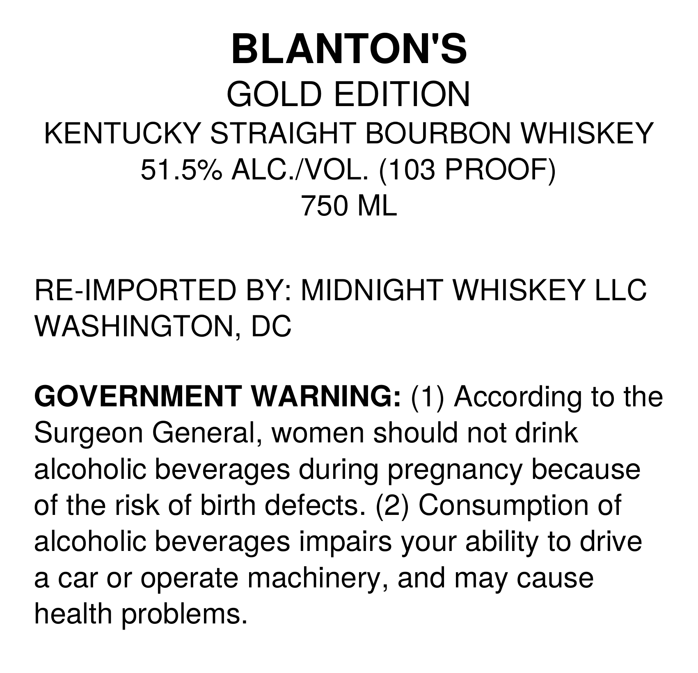

# TTB COLA Label Images - TTBID 26216001000573

**Brand Name:** BLANTON

**Issue Date:** 08/11/2026

**Origin Code:** 4K

**Product Class/Type:** 101

**Source:** [TTB Public COLA Registry](https://ttbonline.gov/colasonline/viewColaDetails.do?action=publicFormDisplay&ttbid=26216001000573)

## Label Images

### Label 1

### Label 2

### Label 3

## Extracted Label Text

*Text extracted via OCR - may contain errors*

**Detected Proof:** 103

### Label 1

Gach bottle is necoededwith the Iasten BRegistnat
(his 8Bounbon
'dumfedo
43
GBarnelONo: 41
Illte hetieve this is the finest
TBtantono
at
BBtanton Of)istilling Gompany;
OMohudin Htunhodse
49-UhxakRao]
bottle gfwfiskey everpnoduced,
Otomlany
Ghis eRegistened 8BottleONo is
8 )
gffoudingyyou extnaflauoss
KENTUCKY STRAICHT
Ofndividually setected fittened and bottled by handat
103
Sppook;
bouqueb and ghanacten.
BOURBON WHISKEY
Distilled & Bottled by Blanton Distilling Company
Frankfort, Kentucky
51.5% Alc.
Vol
750 ML
e
Whiskey_

### Label 2

Blanton

i

6

KENTUCKY STRAIGHT

BOURBON WHISKEY

750 ml

### Label 3

BLANTON'S
GOLD EDITION
KENTUCKY STRAIGHT BOURBON WHISKEY
51.5% ALC /VOL. (103 PROOF)
750 ML
RE-IMPORTED BY: MIDNIGHT WHISKEY LLC
WASHINGTON, DC
GOVERNMENT WARNING: (1) According to the
Surgeon General,
women should not drink
alcoholic beverages during pregnancy because
of the risk of birth defects. (2) Consumption of
alcoholic beverages impairs your ability to drive
a car or
operate machinery,
J
and may cause
health problems.
