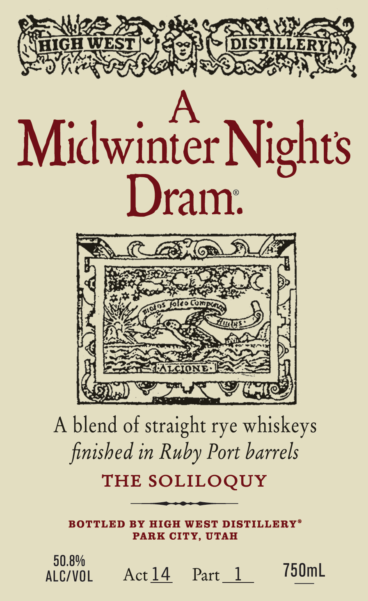
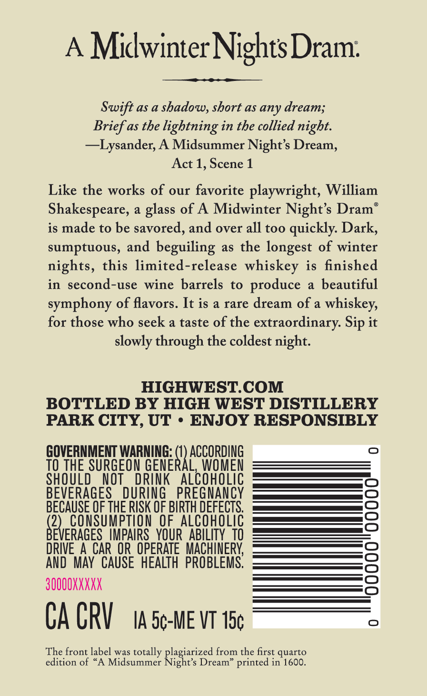

# TTB COLA Label Images - TTBID 26216001000658

**Brand Name:** HIGH WEST

**Fanciful Name:** A MIDWINTER NIGHT'S DRAM

**Issue Date:** 08/12/2026

**Origin Code:** 45

**Product Class/Type:** 122

**Source:** [TTB Public COLA Registry](https://ttbonline.gov/colasonline/viewColaDetails.do?action=publicFormDisplay&ttbid=26216001000658)

## Label Images

### Label 1

### Label 2

## Extracted Label Text

*Text extracted via OCR - may contain errors*

### Label 1

$3354,

Oss

STAD

HIGH WEST |<} @

>| DISTILLERY

AD

Yeoh

PIF

WAS ETS

WN

Midwinter Nights

aly.

SEN

Wwe

Ve

HC NOE

koko

70)

‘

By

r

i

cae NS

ee

=n

Axim

q

ee

y

aca t a

PALCIONE ES

Ea 3

nt

Gs

LE) Pore PE

A blend of aah rye whiskeys

finished in Ruby Port barrels

THE SOLILOQUY

BOTTLED BY HIGH WEST DISTILLERY®

PARK CITY, UTAH

alive

Actl4  Part_1

750mL

### Label 2

Midwinter NightsDram:
Swift
aS a
shadow, short as any dream;
Brief as the lightning in the collied night.
~~Lysander; A Midsummer Night's Dream,
Act 1, Scene 1
Like the works of our favorite playwright, William
Shakespeare,
a
glass of A Midwinter Night's Dram"
is made to be savored, and over all too quickly Dark,
sumptuous, and beguiling
as the
longest of winter
nights, this limited-release whiskey is finished
in second-use wine barrels to
produce
beautiful
symphony of flavors. It is a rare dream of a
whiskey,
for those who seek a taste of the extraordinary:
it
slowly through the coldest night:
HIGHWESTCOM
BOTTLED BY HIGH WEST DISTILLERY
PARK CITY, UT
ENJOY RESPONSIBLY
GOVERNMENT WARNING: (1) ACCORDING
TO THE SURGEON GENERAL, WOMEN
SHQULD
NOT
DRLNK
AlcoHOLIC
BEVERAGES
DURING
PREGNANCY
BECAUSE OF THE RISK OF BIRTH DEFECTS
(2)_ConSuMPTION  OF.ALCOHOLIC
6
BEVERAGES   IMPAIRS   YOUR   ABILITY TO
DRIVE
A
CAR  OR  OPERATE  MACHINERK
AND
May   CAUSE   HEALTH  PROBLEMS,
3OQOOXXXXX
CA CRV
IA 5c-ME VT 15c
The front label was totally
from the first quarto
edition of *A
Midsummer
Rgizitde
Dream" printed in 1600_
Sip
