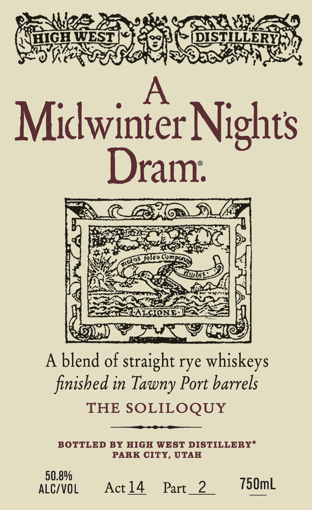
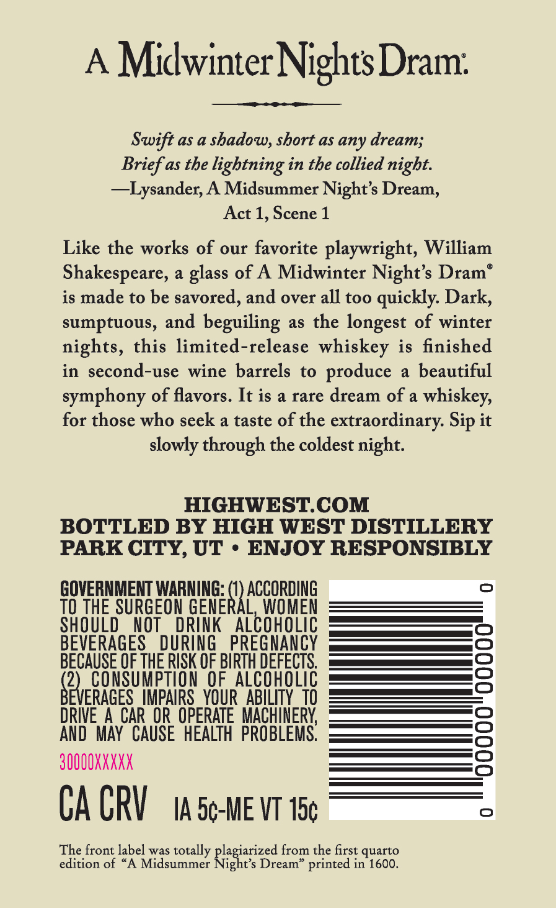

# TTB COLA Label Images - TTBID 26216001000659

**Brand Name:** HIGH WEST

**Fanciful Name:** A MIDWINTER NIGHT'S DRAM

**Issue Date:** 08/14/2026

**Origin Code:** 45

**Product Class/Type:** 122

**Source:** [TTB Public COLA Registry](https://ttbonline.gov/colasonline/viewColaDetails.do?action=publicFormDisplay&ttbid=26216001000659)

## Label Images

### Label 1

### Label 2

## Extracted Label Text

*Text extracted via OCR - may contain errors*

### Label 1

STAD

HIGH WEST

WIZE.

AD

oily

D

:

K

WSY

Midwinter Nights

ayy.

es

RB

oN

DALLA

Fo beds.

Cue

RET XC

;

EO

4

:

<a.

ee

ALi A

«

ee

y

ee<TI— 4

PALCIONG ESZ

Hy

Gs

a) we tN SO CL

Abl

end of aig rye whiskeys

finished in Tawny Port barrels

THE SOLILOQUY

BOTTLED BY HIGH WEST DISTILLERY®

PARK CITY, UTAH

igual

Actl4 Part 2

750mL

### Label 2

A
MidwinterNightsDram:
Swift as a shadow, short as any dream;
Brief as the lightning in the collied night:
~~Lysander; A Midsummer Nights Dream,
Act 1, Scene 1
Like the works of our favorite playwright, William
Shakespeare,
a
glass of A Midwinter Night's Dram
is made to be savored, and over all too quickly Dark,
sumptuous, and beguiling
as the
longest of winter
nights, this limited-release whiskey is finished
in second-use wine barrels to produce
beautiful
symphony of flavors. It is a rare dream of a
whiskey,
for those who seek a taste of the
extraordinary: Sip it
slowly through the coldest night:
HIGHWEST.COM
BOTTLED BY HIGH WEST DISTILLERY
PARK CITY, UT
ENJOY RESPONSIBLY
GOVERNMENT WARNING: (0) ACCORDING
TO THE SURGEON GENERAL,WOMEN
SHOULD
NOT
DRINK
AlcoHOLIC
BEVERAGES
DURING
PREGNANCY
BECAUSE QF THE RISK OF BIRTH DEFECTS
(2)_consumpTION , OF.ALCQHOLIC
BEVERAGES  IMPAIRS_YOUR ABILITY TO
DRIVE A CAR OR OPERATE  MACHINERK
AND MAY  CAUSE   HEALTH  PROBLEMS
3QQQOXXXXX
CA CRV
IA 5c-ME VT 15c
The front label was totally
from the first quarto
edition of
A Midsummer
Ragizriide
Dream" printed in 1600.
