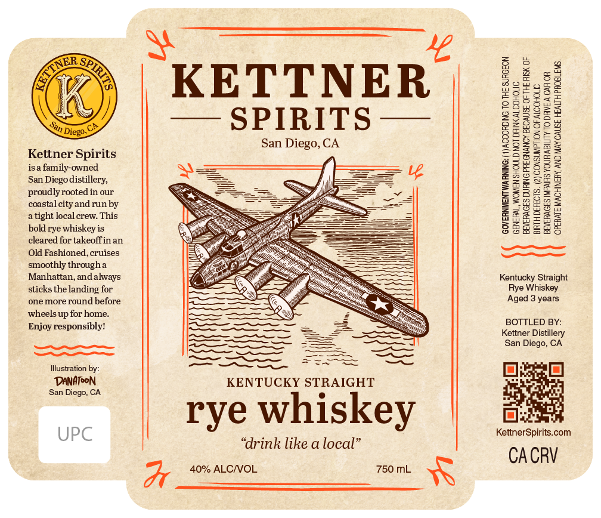

# TTB COLA Label Images - TTBID 26216001000672

**Brand Name:** KETTNER SPIRITS

**Issue Date:** 08/11/2026

**Origin Code:** 01

**Product Class/Type:** 102

**Source:** [TTB Public COLA Registry](https://ttbonline.gov/colasonline/viewColaDetails.do?action=publicFormDisplay&ttbid=26216001000672)

## Label Images

### Label 1

## Extracted Label Text

*Text extracted via OCR - may contain errors*

**Detected Proof:** 80
**Detected Age:** 3 Years

### Label 1

te
‘ej *KETTNER
—+ SPIRITS —

San Diego, CA

Kettner Spirits
isa family-owned

San Diegodistillery,
proudly rooted in our
coastal city and run by
a tight local crew. This
bold rye whiskey is
cleared for takeoffin an
Old Fashioned, cruises
smoothly througha
Manhattan, and always
sticks the landing for
one more round before
wheels up for home.
Enjoy responsibly!

—e
OT

llustration by:

DANATEON KENTUCKY STRAIGHT

a rye whiskey

“drink like a local”

Wr 40% ALC/VOL 750 mL X

UPC

GOVERNMENTWA NING: (1) ACCORDING TO THE SURGEON
BEVERAGES DURING PREGNANCY BECAUSE OF THE RISK OF
BIRTH DEFECTS. (2) CONSUMPTION OF ALCOHOLIC
OPERATE MACHINERY, AND MAY CAUSE HEALTH PROBLEMS,

GENERAL, WOMEN SHOULD NOT DRINK ALCOHOLIC
BEVERAGES IMPAIRS YOURABILITY TO DAVE A CAR OR

Kentucky Straight
Rye Whiskey
Aged 3 years

BOTTLED BY:
Kettner Distillery
San Diego, CA

KettnerSpirits.com

CACRV
