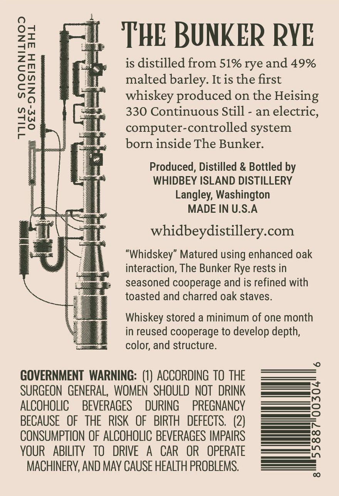
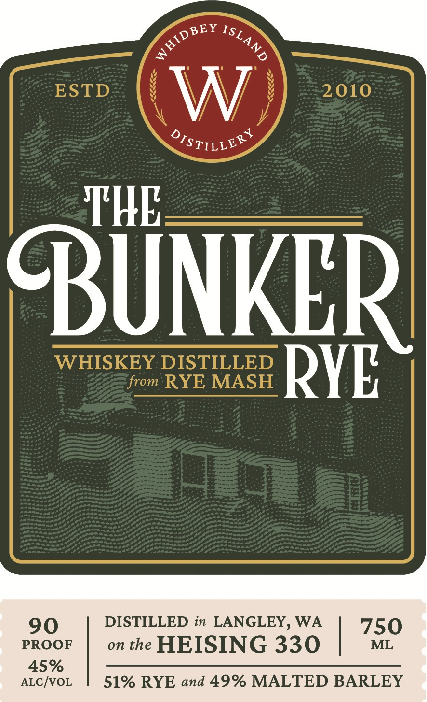

# TTB COLA Label Images - TTBID 26216001000687

**Brand Name:** WHIDBEY ISLAND DISTILLERY

**Fanciful Name:** BUNKER RYE

**Issue Date:** 08/11/2026

**Origin Code:** 07

**Product Class/Type:** 140

**Source:** [TTB Public COLA Registry](https://ttbonline.gov/colasonline/viewColaDetails.do?action=publicFormDisplay&ttbid=26216001000687)

## Label Images

### Back Label

### Front Label

## Extracted Label Text

*Text extracted via OCR - may contain errors*

**Detected Proof:** 90

### Back Label

0
THE BUNKER RYE
L
is distilled from 51% rye and 49%
malted barley. It is the first
1
whiskey produced on the Heising
330 Continuous Still
an electric,
2
computer-controlled system
born inside The Bunker:
Produced, Distilled & Bottled by
WHIDBEY ISLAND DISTILLERY
Langley; Washington
MADE IN U.S.A
whidbeydistillery com
UJ
"Whidskey" Matured using enhanced oak
interaction, The Bunker Rye rests in
seasoned cooperage and is refined with
toasted and charred oak staves.
Whiskey stored a minimum of one month
in reused cooperage to develop depth,
color; and structure.
GOVERNMENT   WARNING: (1) ACCORDING  TO THE
SURGEON   GENERAL, WOMEN   SHOULD   NOT   DRINK
ALCOHOLIC
BEVERAGES
DURING
PREGNANCY
BECAUSE
OF   THE  RISK
OF   BIRTH   DEFECTS.  (2)
1
CONSUMPTION OF ALCOHOLIC BEVERAGES IMPAIRS
VOUR
ABILITY   TO
DRIVE
A
CAR
OR
OPERATE
MACHINERV, AND MAV CAUSE HEALTH PROBLEMS.
00

### Front Label

4
ESTD
W
2010
OISTILLER]
THE
BUNKERL
WHISKEY DISTILLED
RYE
from RYE MASH
Hq
90
DISTILLED in LANGLEY, WA
750
PROOF
on the
HEISING 330
ML
45%
ALC/VOL
51% RYE and 49% MALTED BARLEY
HIDBEY
ISLAND
