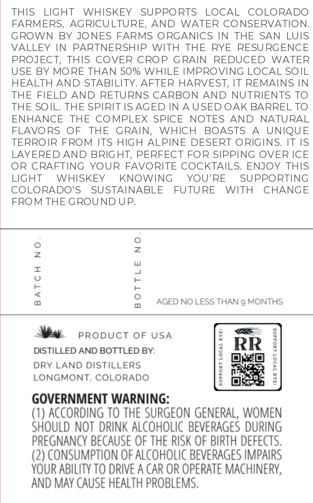
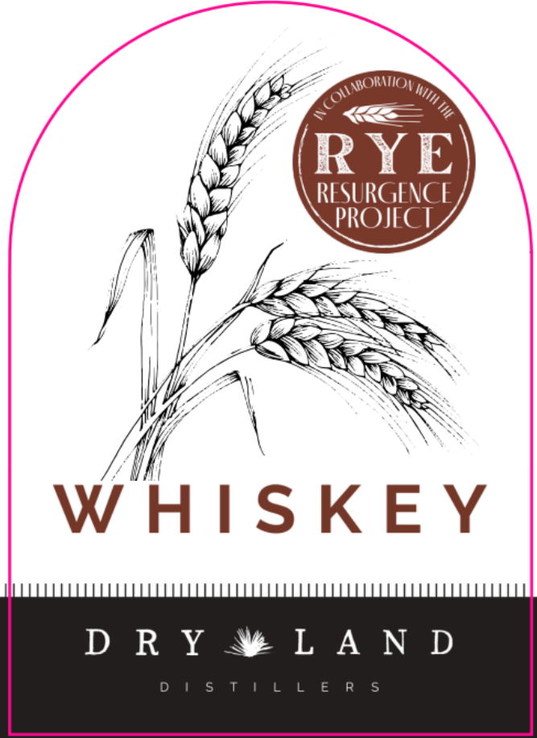
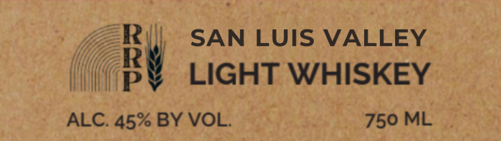

# TTB COLA Label Images - TTBID 26217001000113

**Brand Name:** DRY LAND DISTILLERS

**Issue Date:** 08/17/2026

**Origin Code:** 13

**Product Class/Type:** 144

**Source:** [TTB Public COLA Registry](https://ttbonline.gov/colasonline/viewColaDetails.do?action=publicFormDisplay&ttbid=26217001000113)

## Label Images

### Back Label

### Front Label

### Label 3

## Extracted Label Text

*Text extracted via OCR - may contain errors*

### Back Label

THIS LIGHT WHISKEY SUPPORTS LOCAL COLORADO
FARMERS, AGRICULTURE, AND WATER CONSERVATION.
GROWN BY JONES FARMS ORGANICS IN THE SAN LUIS
VALLEY IN PARTNERSHIP WITH THE RYE RESURGENCE
PROJECT, THIS COVER CROP GRAIN REDUCED WATER
USE BY MORE THAN 50% WHILE IMPROVING LOCAL SOIL
HEALTH AND STABILITY. AFTER HARVEST, IT REMAINS IN
THE FIELD AND RETURNS CARBON AND NUTRIENTS TO
THE SOIL. THE SPIRIT IS AGED IN AUSED OAK BARREL TO
ENHANCE THE COMPLEX SPICE NOTES AND NATURAL
FLAVORS OF THE GRAIN, WHICH BOASTS A UNIQUE
TERROIR FROM ITS HIGH ALPINE DESERT ORIGINS. IT IS
LAYERED AND BRIGHT, PERFECT FOR SIPPING OVER ICE
OR CRAFTING YOUR FAVORITE COCKTAILS. ENJOY THIS
LIGHT WHISKEY KNOWING YOU'RE SUPPORTING
COLORADO'S SUSTAINABLE FUTURE WITH CHANGE
FROM THE GROUND UP.

BATCH NO
BOTTLE NO

AGED NO LESS THAN 9g MONTHS

Wat proouct of usa
DISTILLED AND BOTTLED BY:

DRY LAND DISTILLERS
LONGMONT, COLORADO

GOVERNMENT WARNING:

(1) ACCORDING TO THE SURGEON GENERAL, WOMEN
SHOULD NOT DRINK ALCOHOLIC BEVERAGES DURING
PREGNANCY BECAUSE OF THE RISK OF BIRTH DEFECTS.
(2) CONSUMPTION OF ALCOHOLIC BEVERAGES IMPAIRS
YOUR ABILITY TO DRIVE A CAR OR OPERATE MACHINERY,
AND MAY CAUSE HEALTH PROBLEMS.

907 Luodsns

### Front Label

Fy NBOMATIOY >»

ip

BSS

bes SS

fi

ex

A\

VR

WS

SKE

DRY ®¥LAND

### Label 3

R
SAN LUIS VALLEY
P
LIGHT WHISKEY
ALC. 45% BY VOL:
750 ML
