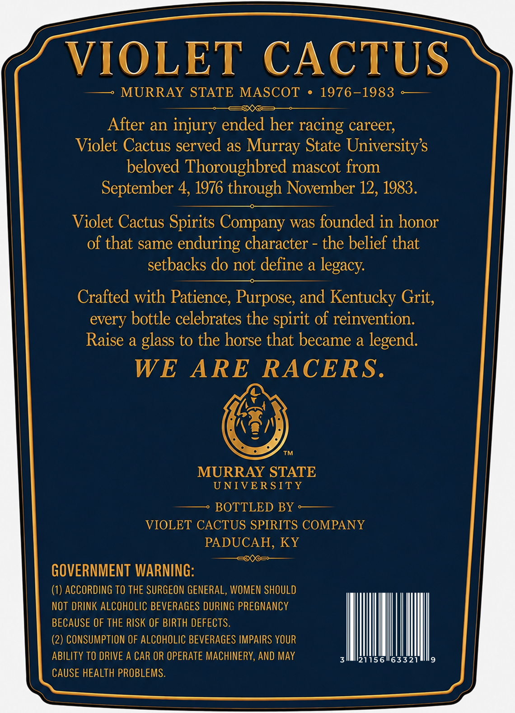
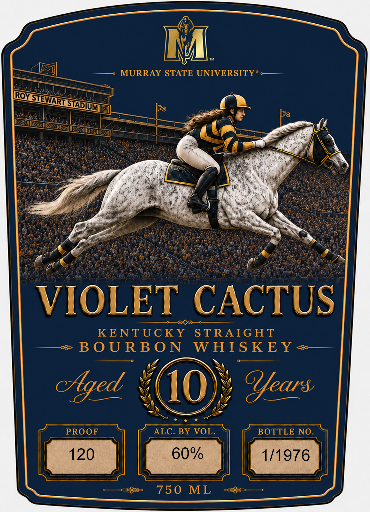

# TTB COLA Label Images - TTBID 26217001000174

**Brand Name:** VIOLET CACTUS

**Fanciful Name:** ANNIVERSARY BOURBON

**Issue Date:** 08/13/2026

**Origin Code:** 22

**Product Class/Type:** 101

**Source:** [TTB Public COLA Registry](https://ttbonline.gov/colasonline/viewColaDetails.do?action=publicFormDisplay&ttbid=26217001000174)

## Label Images

### Back Label

### Front Label

## Extracted Label Text

*Text extracted via OCR - may contain errors*

*1 image(s) excluded: text did not meet readability threshold*

### Back Label

VIOLET
CACTUS
MURRAY STATE MASCOT
1976-1983
After an injury ended her racing career;
Violet Cactus served as Murray State Universitys
beloved Thoroughbred mascot from
September 4, 1976 through November 12, 1983.
Violet Cactus Spirits Company was founded in honor
of that same enduring character
the belief that
setbacks do not define a
legacy
Crafted with Patience, Purpose, and Kentucky Grit,
every bottle celebrates the spirit of reinvention:
Raise a glass to the horse that became a legend:
WE
ARE
RACERS.
MURRAY STATE
UNIVER SITY
BOTTLED BY
VIOLET CACTUS SPIRITS COMPANY
PADUCAH, KY
GOVERNMENT WARNING:
(1) ACCORDING TO THE SURGEON GENERAL, WOMEN SHOULD
NOT DRINK ALCOHOLIC BEVERAGES DURING PREGNANCY
BECAUSE OF THE RISK OF BIRTH DEFECTS.
(2) CONSUMPTION OF ALCOHOLIC BEVERAGES IMPAIRS YOUR
ABILITY TO DRIVE A CAR OR OPERATE MACHINERY, AND MAY
21156163321
CAUSE HEALTH PROBLEMS.
