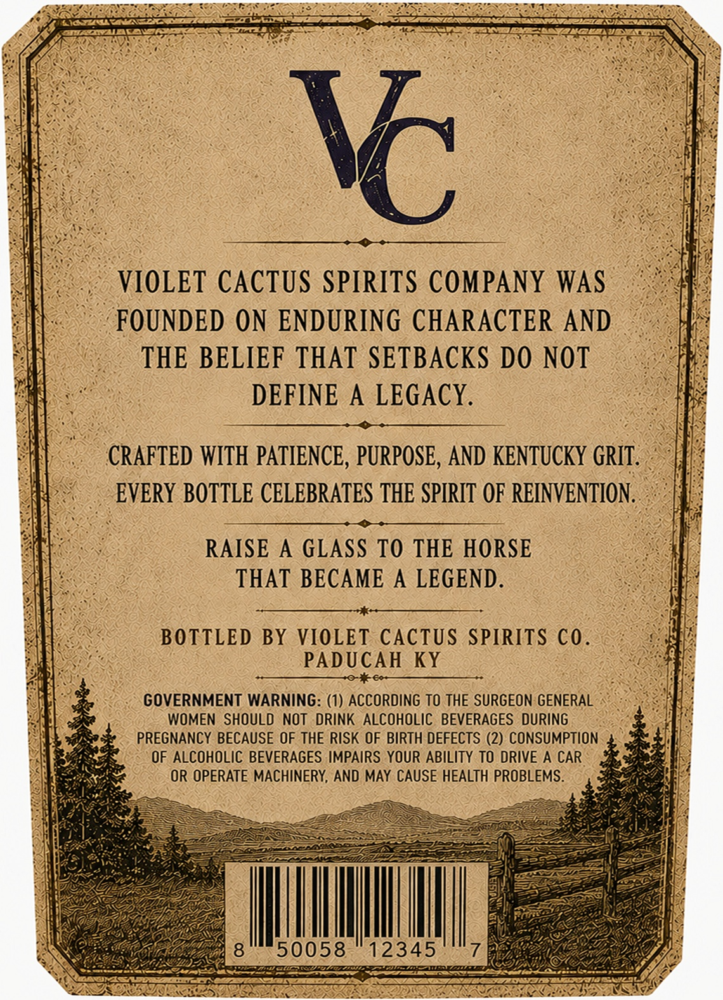
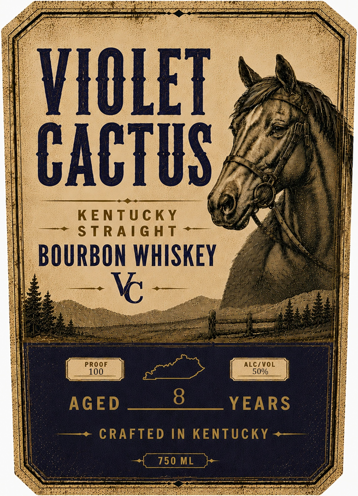

# TTB COLA Label Images - TTBID 26217001000200

**Brand Name:** VIOLET CACTUS

**Issue Date:** 08/12/2026

**Origin Code:** 22

**Product Class/Type:** 101

**Source:** [TTB Public COLA Registry](https://ttbonline.gov/colasonline/viewColaDetails.do?action=publicFormDisplay&ttbid=26217001000200)

## Label Images

### Back Label

### Front Label

## Extracted Label Text

*Text extracted via OCR - may contain errors*

*1 image(s) excluded: text did not meet readability threshold*

### Back Label

VIOLET CACTUS SPIRITS COMPANY WAS
FOUNDED ON ENDURING CHARACTER AND
THE BELIEF THAT SETBACKS DO NOT
DEFINE
A LEGACY.
CRAFTED WITH PATIENCE, PURPOSE, AND KENTUCKY GRIT:
EVERY BOTTLE CELEBRATES THE SPIRIT OF REINVENTION ,
RAISE
A GLASS TO THE HORSE
THAT BECAME
A LEGEND _
BOTTLED BY VIOLET CACTUs SPIRITS C0.
PADUCAH
KY
+0
60-
GOVERNMENT WARNING: (1) ACCORDING TO THE SURGEON GENERAL
WOMEN SHOULD NOT  DRINK ALCOHOLIC BEVERAGES  DURING
PREGNANCY BECAUSE OF THE RISK OF BIRTH DEFECTS (2) CONSUMPTION
OF ALCOHOLIC BEVERAGES IMPAIRS YOUR ABILITY TO DRIVE A CAR
OR OPERATE MACHINERY, AND MAY CAUSE HEALTH PROBLEMS:
8
50058
12345
Vc
