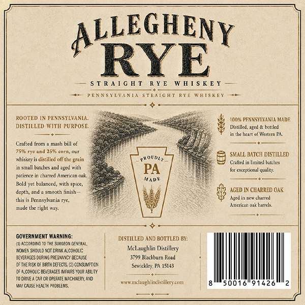
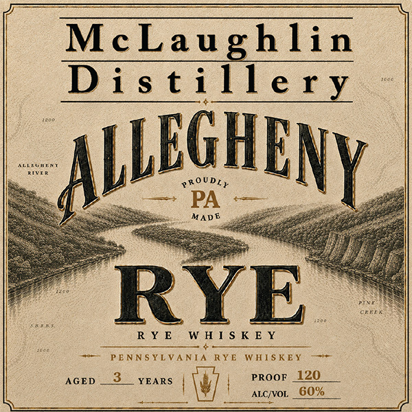

# TTB COLA Label Images - TTBID 26217001000215

**Brand Name:** MCLAUGHLIN DISTILLERY

**Fanciful Name:** ALLEGHENY RYE

**Issue Date:** 08/12/2026

**Origin Code:** 39

**Product Class/Type:** 142

**Source:** [TTB Public COLA Registry](https://ttbonline.gov/colasonline/viewColaDetails.do?action=publicFormDisplay&ttbid=26217001000215)

## Label Images

### Back Label

### Front Label

## Extracted Label Text

*Text extracted via OCR - may contain errors*

### Back Label

LEGHEN
RYE”

— STRAIGHT RYE WHISKEY —

—*— PENNSYLVANIA STRAIGHT RYE WHISKEY =

ROOTED IN PENNSYLVANIA.
DISTILLED WITH PURPOSE.

% 100% PENNSYIVANTA MADE

Crafted from a mash bill of
(eg OTs Z 8 SMALL BATCH DISTILLED
nbiskey is disilled off the grain Crfed in Limited batches

in small atc and aged with 58 fer exceptional gli
patience in charred American oak,

Bold yet balanced, with spice,
depth and a smooth finish AGED IN CHARRED OAK
: Agen new charced
American oak barel.

thisis Penasshania ne,
made the right way.

+

GOVERMENT WARNING: DISTILLED AND BOTTLED BY:

(nAconeone TT sueeeon Gee

OWEN SHOULO NOT ORI ALCOHOLS McLaughlin Distillery

EVEFAGES DURING RESANCEECNISE. 3799 Blackburn Road :

DF THERSKOF BRTH DEFECTS (2) cEASUMETON Sewickley, PA 15183,

(OF A.COHOUC BEVERAGES MNS YOUR BLT saath

TODRNEA TARO OPERATE MACHINERY AND ae ootatotazalllly

pea teat worn anlaughlndstilery.com

### Front Label

McLaughlin

Distillery

EGH

gROUDZ,

EN

PA

MADE

onan

RYE

RYE

Een

un ne

AGED

proor 120 _

ves |

eer,

| atcyvor, 60%
