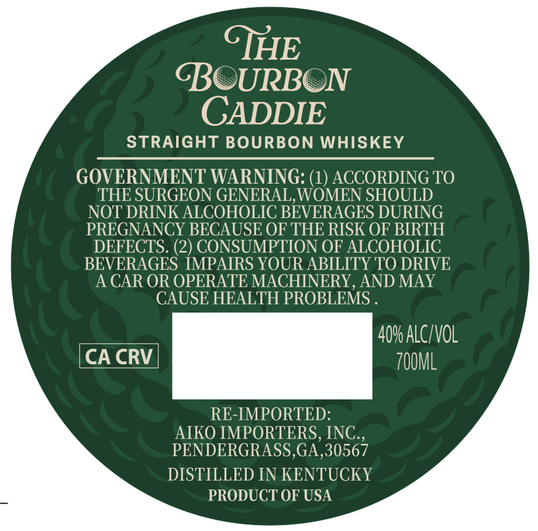
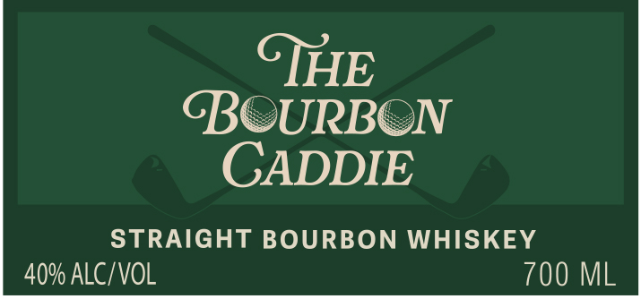

# TTB COLA Label Images - TTBID 26217001000237

**Brand Name:** THE BOURBON CADDIE

**Issue Date:** 08/11/2026

**Origin Code:** 00

**Product Class/Type:** 101

**Source:** [TTB Public COLA Registry](https://ttbonline.gov/colasonline/viewColaDetails.do?action=publicFormDisplay&ttbid=26217001000237)

## Label Images

### Back Label

### Front Label

## Extracted Label Text

*Text extracted via OCR - may contain errors*

**Detected Proof:** 80

### Back Label

CTHE

URBON

CADDIE

STRAIGHT BOURBON WHISKEY

GOVERNMENT WARNING: (1) ACCORDING TO

THE SURGEON GENERAL, WOMEN SHOULD

NOT DRINK ALCOHOLIC BEVERAGES DURING

PREGNANCY BECAUSE OF THE RISK OF BIRTH

DEFECTS. (2) CONSUMPTION OF ALCOHOLIC

BEVERAGES IMPAIRS YOUR ABILITY TO DRIVE

A CAR OR OPERATE MACHINERY, AND MAY

CAUSE HEALTH PROBLEMS

40% ALC/VOL

CA CRV

7OOML

RE-IMPORTED

AIKO IMPORTERS, INC

PENDERGRASS,GA,30567

DISTILLED IN KENTUCKY

PRODUCT OF USA

### Front Label

GHE
GOURBON
CADDIE
STRAIGHT BOURBON WHISKEY
40% ALCIVOL
700 ML
