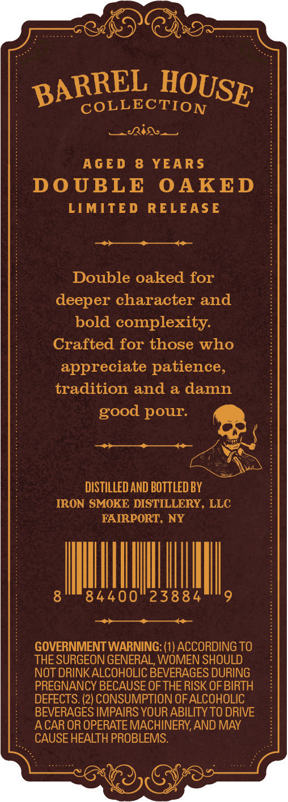
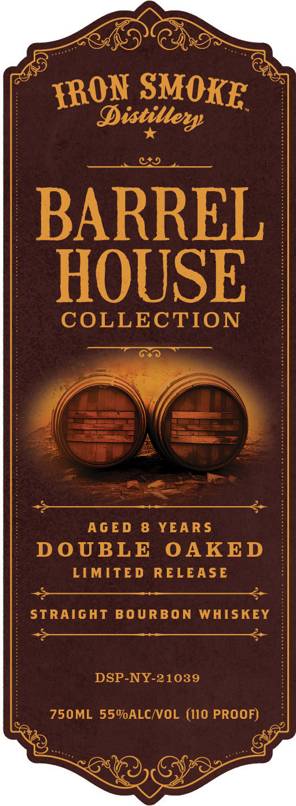
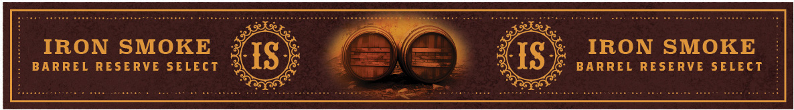

# TTB COLA Label Images - TTBID 26217001000270

**Brand Name:** IRON SMOKE DISTILLERY

**Fanciful Name:** AGED 8 YEARS DOUBLE OAKED

**Issue Date:** 08/11/2026

**Origin Code:** 02

**Product Class/Type:** 101

**Source:** [TTB Public COLA Registry](https://ttbonline.gov/colasonline/viewColaDetails.do?action=publicFormDisplay&ttbid=26217001000270)

## Label Images

### Back Label

### Label 1

### Label 3

## Extracted Label Text

*Text extracted via OCR - may contain errors*

**Detected Age:** 8 Years

### Back Label

COLLECTION
Ria
AgED
8
YEAR S
DoUBLE
OAKED
LIMITED
RELEASE
Double oaked for
deeper character and
bold complexity.
Crafted for those who
appreciate patience,
tradition and a damn
pour:
DISTILLED AND BOTTLED BY
IRON SMOKE DISTILLERY, LLC
FAIRPORT, NY
84400
23884
GOVERNMENT WARNING: (1) ACCORDING TO
THE SURGEON GENERAL, WOMEN SHOULD
NOT DRINKALCOHOLIC BEVERAGES DURING
PREGNANCY BECAUSE OF THE RISK OF BIRTH
DEFECTS. (2) CONSUMPTION OF ALCOHOLIC
BEVERAGES IMPAIRS YOUR ABILITY TO DRIVE
ACAR OR OPERATE MACHINERY,AND MAY
CAUSE HEALTH PROBLEMS:
BARREL
HOUSE
good

### Label 1

Distiller
BARREL
HOUSE
COLLECTION
AGED
8
YEAR S
DoUBLE
OAKED
LIMITED
RELEASE
STRAIGHT BOURBON WHISKEY
DSP-NY-21039
750ML 559ALCIVOL (I10 PROOF)
SMOKE
IRON

### Label 3

au

IRON SMOKE

IRON SMOKE

BARREL RESERVE SELECT

BARREL RESERVE SELECT

nie
