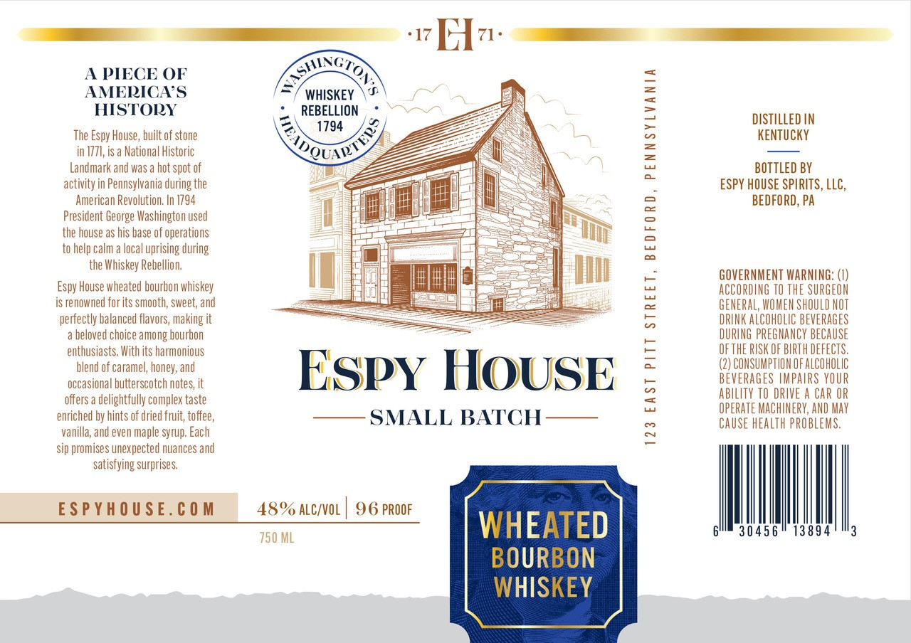

# TTB COLA Label Images - TTBID 26217001000301

**Brand Name:** ESPY HOUSE

**Issue Date:** 08/11/2026

**Origin Code:** 39

**Product Class/Type:** 141

**Source:** [TTB Public COLA Registry](https://ttbonline.gov/colasonline/viewColaDetails.do?action=publicFormDisplay&ttbid=26217001000301)

## Label Images

### Label 1

## Extracted Label Text

*Text extracted via OCR - may contain errors*

**Detected Proof:** 96

### Label 1

F1Hv:
A PIECE OF
AMERICAS
WHISKEY
HISTOLY
REBELLION
1794
DISTILLED IN
The Espy House, built of stone
2
keNTUCKY
in 1771,is a National Historic
Landmark and was a hot spot of
3
Bottled BY
activity in Pennsylvania during the
ESPY HOUSE SPIRITS, LLC,
American Revolution: In 1794
BEDFORD, PA
President George Washington used
the house as his base of operations
2
to help calm
ocal
Luprising during
the Whiskey Rebellion;
GOVERNMENT WARNING; (V)
House wheated bourbon whiskey
ACCORDING TO ThE SURGEON
is renowned forits smooth, sweet, and
GENERAL; WOMEN SHOULD NOT
perfectly balanced flavors, making it
5
DRINK ALCOHOLIC BEVERAGES
beloved choice among bourbon
DURING PREGNANCY BECAUSE
enthusiasts, With its harmonious
2
OFTHE RUSK OF BIRTh DEFECTS.
blend of caramel, honey; and
ESpY HOUSE
(2) CONSUMPTION OFAlCohOlic
occasional butterscotch notes; it
BEVERAGES LMPAIRS YOUR
offers
delightfully complex taste
5
ability TO DRIVE A CAr OR
OPERATE MACHINERY, AND May
enriched by hints of dried fruit; toffee,
SMALL BATCH
CAUSE heALTH PROBLeMS,
vanilla; and even maple syrup: Each
~
sip promises unexpected nuances and
satisfying surprises
ESPYhOUSE. € 0 M
48% ALC/VOL
96 PROOF
750 ML
WHEATED
3045 6
13894
BOURBON
WHISKEY
6o
Rpow /)
Espy '
