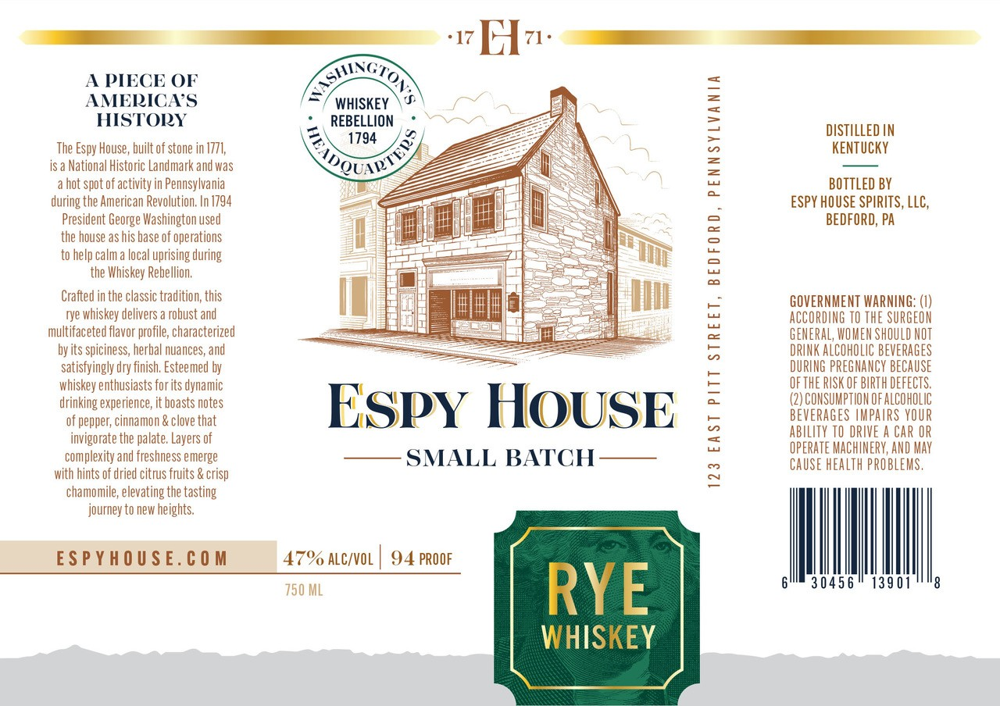

# TTB COLA Label Images - TTBID 26217001000304

**Brand Name:** ESPY HOUSE

**Issue Date:** 08/11/2026

**Origin Code:** 39

**Product Class/Type:** 142

**Source:** [TTB Public COLA Registry](https://ttbonline.gov/colasonline/viewColaDetails.do?action=publicFormDisplay&ttbid=26217001000304)

## Label Images

### Label 1

## Extracted Label Text

*Text extracted via OCR - may contain errors*

**Detected Proof:** 94

### Label 1

~#Ev.
A PIECE OF
Exze
AMERICAS
WHISKEY
HISTODY
REBELLION
DISTILLED IN
The Espy House, built of stone in 1771,
1794
2
KENTUCKY
IS &
National Historic Landmark and was
hot spot of activity in Pennsylvania
3
BOTTLED BY
during the American Revolution; In 1794
ESPY HOUSE SPIRITS, LLC,
President George Washington used
BEDFORD, PA
the house as his base of operations
to help calm a local uprising during
the Whiskey Rebellion;
2
Crafted in the classic tradition; this
GOVERNMENT WARNING: ()
rye whiskey delivers a robust and
5
ACCORdING TO ThE SURGEON
multifaceted flavor profile, characterized
GENERAL, WOMEN SHOULD NOT
by its spiciness, herbal nuances, and
5
DRINK ALCOhOLIC BEvErages
satisfyingly dry finish; Esteemed by
DURING PREGNANCY BECAUSE
whiskey enthusiasts for its dynamic
E
ofthE RUSK OF BIRTH defECTS,
drinking experience;
boasts notes
ESpY HOUSE
(2) CONSUMPTION OFALCOhOLIC
of pepper; cinnamon & clove that
5
beverages IMPARS YOUR
invigorate the palate; Layers of
abilITy TO DRIVE a CAr OR
5
operATE MACHUNERY, AND MAY
complexity and freshness emerge
SMALL BATCH
CAUSE health PROBLEMS ,
with hints of dried citrus fruits & crisp
~
chamomile; elevating the
journey to new
heights
ESPYHO USE. € 0 M
47% ALC/VOL
94 PROOF
750 ML
RYE
3045 6
13901
WHISKEY
0
kel1y
 tasting
