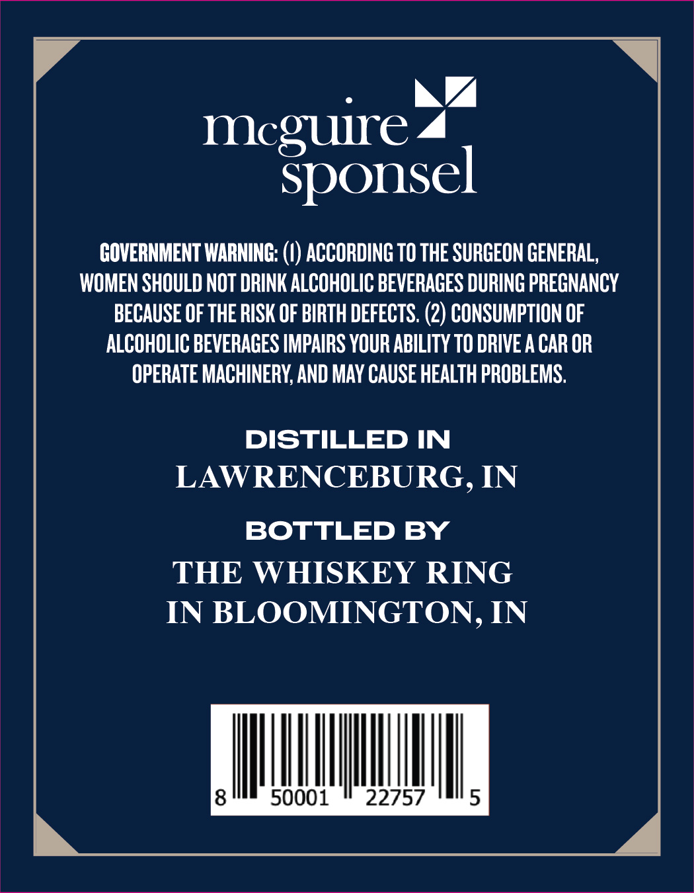
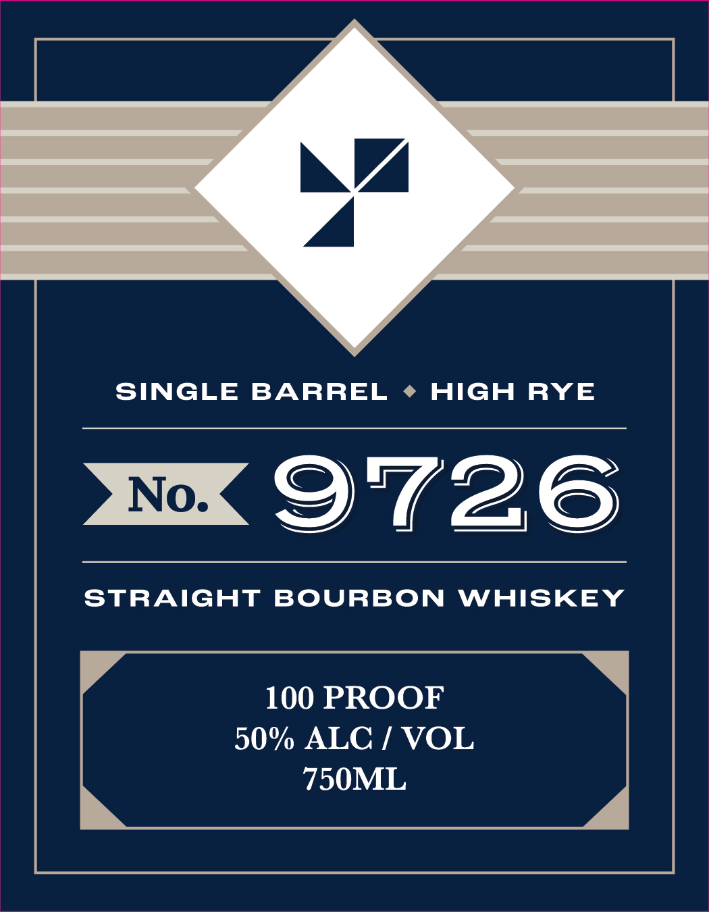

# TTB COLA Label Images - TTBID 26217001000306

**Brand Name:** SINGLE BARREL NO. 9726

**Issue Date:** 08/13/2026

**Origin Code:** 19

**Product Class/Type:** 101

**Source:** [TTB Public COLA Registry](https://ttbonline.gov/colasonline/viewColaDetails.do?action=publicFormDisplay&ttbid=26217001000306)

## Label Images

### Back Label

### Front Label

## Extracted Label Text

*Text extracted via OCR - may contain errors*

**Detected Proof:** 100

### Back Label

meguire
Sponsel
GOVERNMENT WARNING:
ACCORDING TO THE SURGEON GENERAL,
WOMEN SHOULD NOT DRINK ALCOHOLIC BEVERAGES DURING PREGNANCY
BECAUSE OF THE RISK OF BIRTH DEFECTS: (2) CONSUMPTION OF
ALCOHOLIC BEVERAGES IMPAIRS YOUR ABILITY TO DRIVE A CAR OR
OPERATE MACHINERY, AND MAY CAUSE HEALTH PROBLEMS
DISTILLED IN
LAWRENCEBURG , IN
BOTTLED BY
THE WHISKEY RING
IN BLOOMINGTON, IN
8
50001
22757
5

### Front Label

SINGLE
BARREL
HIGH
RYE
No:
9726
StRAIGHT
BOURBON
WHISKEY
100 PROOF
50% ALC / VOL
750ML
