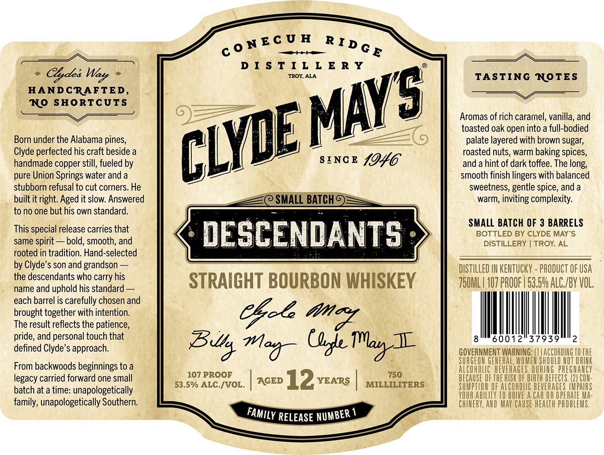

# TTB COLA Label Images - TTBID 26217001000312

**Brand Name:** CLYDE MAY'S

**Issue Date:** 08/11/2026

**Origin Code:** 10

**Product Class/Type:** 101

**Source:** [TTB Public COLA Registry](https://ttbonline.gov/colasonline/viewColaDetails.do?action=publicFormDisplay&ttbid=26217001000312)

## Label Images

### Label 1

### Label 2

## Extracted Label Text

*Text extracted via OCR - may contain errors*

*1 image(s) excluded: text did not meet readability threshold*

**Detected Proof:** 107
**Detected Age:** 12 Years

### Label 1

D I $ T I L L € R Y
Cldea
TROY; ALA
TASTING NOTES
HANDCRAFTED,
NO SHORTCUTS
Aromas of rich cararel, vanilla, and
toasted oak open into a full-bodied
Born under the Alabama pines,
0
palate layered with brown sugar;
Clyde perfected his craft beside a
roasted nuts, warm baking spices_
handmade copper still; fueled by
SINC E
4946
and a hint of dark toffee. The
pure Union Springs water and a
smooth finish lingers with balanced
stubborn refusal to cut corners. He
sweetness;
spice,
built it right Aged it slow. Answered
SMALL BATCH =
warm; inviting complexity:
to no one but his own standard.
SMALL BATCH OF 3 BARRELS
This special release carries that
DESCENDANTS
BOTTLED BY CLYDE MAYS
same spirit
bold, smooth; and
DISTILLERY
TROY; AL
rooted in tradition. Hand-selected
by Clyde's son and grandson
DISTILLED IN KENTUCKY - PRODUCT OF USA
the descendants who carry his
STRAIGHT BOURBON WHISKEY
750ML | 407 PROOF | 53.5V ALC /BV VOL,
name and uphold his standard
each barrel is carefully chosen and
brought together with intention:
Ceze
The result reflects the patience ,
pride, and personal touch that
60012"37939
defined Clyde's approach:
Tlay L
GOVERNMENT WARNING: (1 ) ACCORDING TOTHE
SURGEON GENERAL, WOMEM ShOULD NOT DRIK
From backwoods beginnings to a
ALCOHOLIC  BEVERAGes QURIG PREGhAnCY
legacy carried forward one small
107 PROOF
AGED
12
YEARS
750
BECAUSE OF THE RUSK OF BIRTH DEFECTS. (2| COn:
batch at a time: unapologetically
53.5%/ ALC /VOL.
MILLILITERS
SUMpTION €F ALCOHOLC BEVERAGES LMpAUAS
YOUR AbILITY TO DRIVE A CAR OR OPERATE Ma:
family, unapologetically Southern:
CHINERY, AND MAY CAUSE HEALTH PROBLEMS .
RELEASE
C0 NEC U H
R I d G E
Weyt
MAYS
CLYE
long;
gentle
and
omd
U&e
Balrs
Morx"
FAMILY
NUMBER
