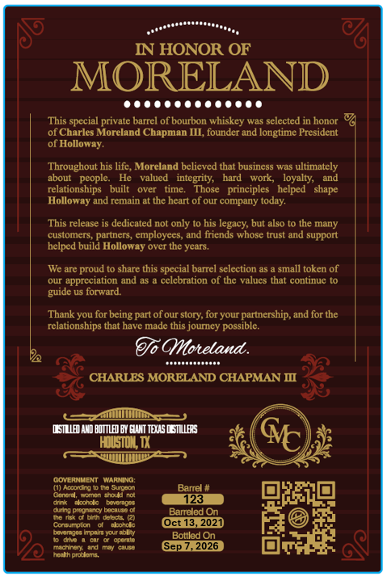
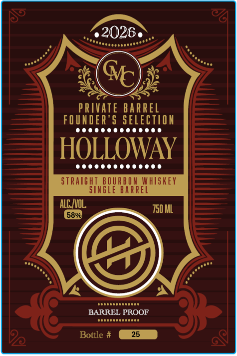

# TTB COLA Label Images - TTBID 26217001000318

**Brand Name:** HOLLOWAY

**Fanciful Name:** MORELAND

**Issue Date:** 08/11/2026

**Origin Code:** 44

**Product Class/Type:** 101

**Source:** [TTB Public COLA Registry](https://ttbonline.gov/colasonline/viewColaDetails.do?action=publicFormDisplay&ttbid=26217001000318)

## Label Images

### Back Label

### Front Label

## Extracted Label Text

*Text extracted via OCR - may contain errors*

### Back Label

IN HONOR OF
MORELAND
This
private barrel of bourbon whiskey was selected in honor %
of Charles Moreland Chapman III, founder and longtime President
of Holloway:
Throughout his lifc, Moreland bclicved that busincss was ultimately
about
people-
valued
integrity;
hard
WOIk,
loyalty;
and
relationships
built
over
me
Those
principles   helped
shape
Holloway and remain at the heart of our company today:
This release is dedicated not only to his legacy; but also to the many
customers
partners, employees, and friends whose trust and support
helped build Holloway ovcr the years.
We are proud t0 share this
barrel sclection as
small token of
appreciation and as
celebralion of the valucs that continue t0
guide us forward
Thank you for being part ofour story; for your partnership, and for the
relationships that have made this jourey possible
GYoteland .
CHARLES MORELAND CHAPMAN M
LSMMANDBUTTLDBY GUIT TES [BILLBS
Houstok WX
coverNMENT  WarNino:
) Aocotrg 0
Aern
Barrel #
Banadtomcn
Houdeno
Fadc
Batomc
123
Ginodeo
Krtaie
Bancled On
Jha Itd Gt Gt (
Lonsumoton
acord
Oct 13
2021
bnmans monletalmblcy
Ol
Ooumin
Bollled On
acnnana
Jn
(Sep Z,2026
IthprdeTa
Spccial
spccial E

### Front Label

2026
M
PRIVATE BARREL
FOUNER'5 SELECTIOA
HOLLOWAY
STRAIght_BOURBOM WhISkey
SInGLe BArrei
AlC NOL
750 ML
589
BARREL PROOF
Bottle #
