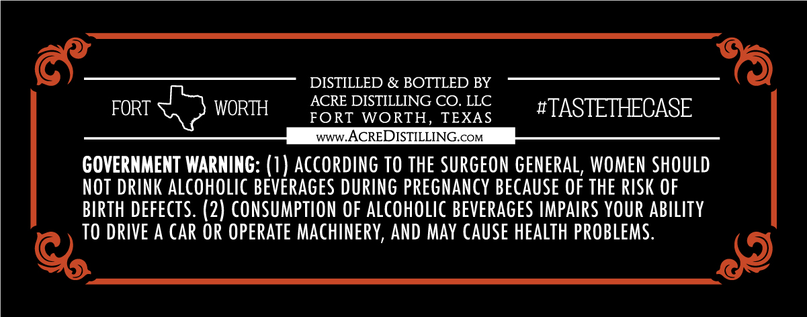
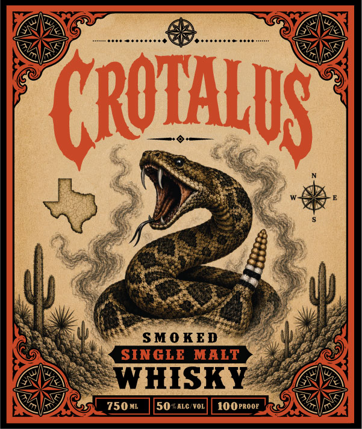

# TTB COLA Label Images - TTBID 26217001000412

**Brand Name:** CROTALUS SMOKED SINGLE MALT WHISKY

**Issue Date:** 08/13/2026

**Origin Code:** 44

**Product Class/Type:** 118

**Source:** [TTB Public COLA Registry](https://ttbonline.gov/colasonline/viewColaDetails.do?action=publicFormDisplay&ttbid=26217001000412)

## Label Images

### Back Label

### Front Label

## Extracted Label Text

*Text extracted via OCR - may contain errors*

### Back Label

DISTILLED & BOTTLED BY
ACRE DISTILLING CO. LLC
FORT
WORTH
FORT
WORTH,
TEXAS
#TASTETHCASE
www.ACREDISTILLING.cOM
GOVERNMENT WARNING: (1) AccoRdING TO ThE SURGEON geNERAL, WOMEN SHOULD
NOT DRINK aLCohOlic beverages DURING pregnancy because OF ThE RISK OF
BIRTH DEFECTS. (2) CONSUMPTION OF ALcoholic BEVERAGES IMPAIRS YOUR AbILIty
TO DRIVE A CAR OR OPERATE MachineRY, ANd May Cause HEALTh PROBLEMS.

### Front Label

(RQIALS
SMO KED
SINGLE MALT
WHISKY
750 ML
50KALC VOL
100PROOE
