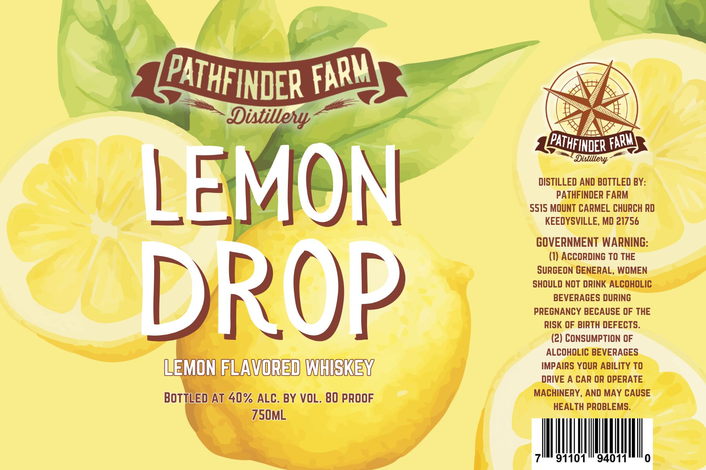

# TTB COLA Label Images - TTBID 26217001000442

**Brand Name:** PATHFINDER FARM

**Issue Date:** 08/12/2026

**Origin Code:** 25

**Product Class/Type:** 149

**Source:** [TTB Public COLA Registry](https://ttbonline.gov/colasonline/viewColaDetails.do?action=publicFormDisplay&ttbid=26217001000442)

## Label Images

### Label 1

## Extracted Label Text

*Text extracted via OCR - may contain errors*

**Detected Proof:** 80

### Label 1

B=

x

PATHFINDER FRR

SS

pv 7

ani

7

A We

wie

cy

AN:

Laat!

“a

p PAT THFINDER FOE

na Wy 3

DISTILLED AND BOTTLED BY:

PATHFINDER FARM

le

5515 MOUNT CARMEL CHURCH RD

meee eee

@);

KEEDYSVILLE, MD 21756

GOVERNMENT WARNING

(1) ACCORDING TO THE

SURGEON GENERAL, WOMEN

SHOULD NOT DRINK ALCOHOLIC

PD

BEVERAGES DURING

PREGNANCY BECAUSE OF THE

IN

RISK OF BIRTH DEFECTS.

UP

(2) CONSUMPTION OF

ALCOHOLIC BEVERAGES

- FEAVOREDIWHISKEN,

IMPAIRS YOUR ABILITY TO

DRIVE A CAR OR OPERATE

“| LED/AT 40% ALC. BY VOL. 80 PROOF

MACHINERY, AND MAY CAUSE

HEALTH PROBLEMS.

7S50ML

|

|

|

|

|

I

91101

94011

i
