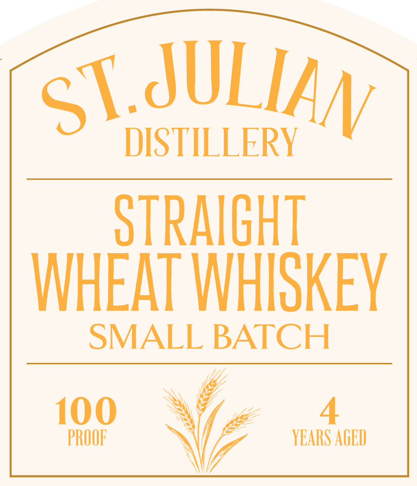
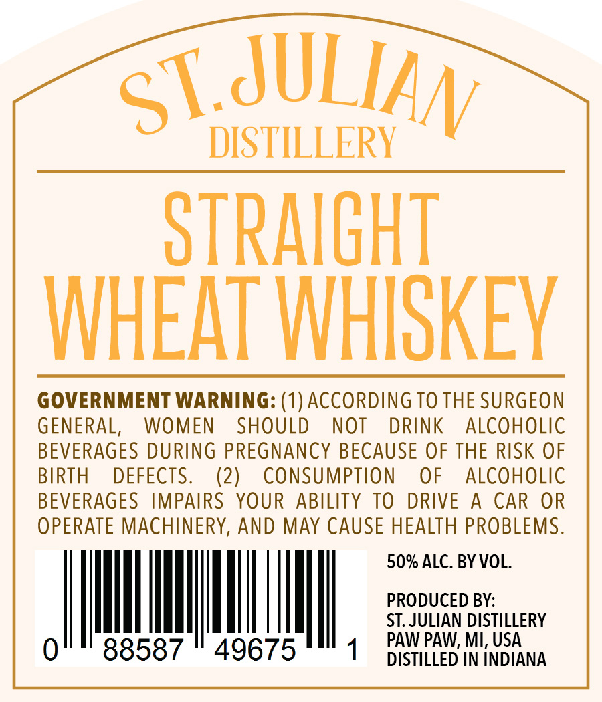

# TTB COLA Label Images - TTBID 26217001000527

**Brand Name:** ST. JULIAN DISTILLERY

**Issue Date:** 08/14/2026

**Origin Code:** 06

**Product Class/Type:** 109

**Source:** [TTB Public COLA Registry](https://ttbonline.gov/colasonline/viewColaDetails.do?action=publicFormDisplay&ttbid=26217001000527)

## Label Images

### Label 1

### Label 2

## Extracted Label Text

*Text extracted via OCR - may contain errors*

**Detected Proof:** 100

### Label 1

ST JULIAN
DISTILLERY
STRAIGHT
WHEAT WHISKEY
SMALL BATCH
100
4
PROOF
YEARS AGED

### Label 2

ST JULIAN
DISTILLERY
STRAIGHT
WHEAT WHISKEV
GOVERNMENT WARNING: (1) ACCORDING TO THE SURGEON
GENERAL,
WOMEN
SHOULD
NOT
DRINK
ALCOHOLIC
BEVERAGES DURING PREGNANCY BECAUSE OF THE RISK OF
BIRTH
DEFECTS.
(2)
ConsumPTiOn
OF
ALCOHOLIC
BEVERAGES
IMPAIRS   YOUR ABILITY TO
DRIVE
A
CAR
OR
OPERATE MACHINERY, AND MAY CAUSE HEALTH PROBLEMS.
50% ALC. BY VOL.
PRODUCED BY:
ST. JULIAN DISTILLERY
88587
49675
PAW PAW; MI; USA
DISTILLED IN INDIANA
