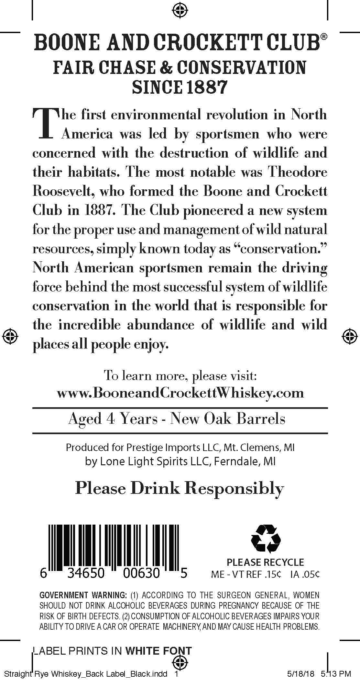
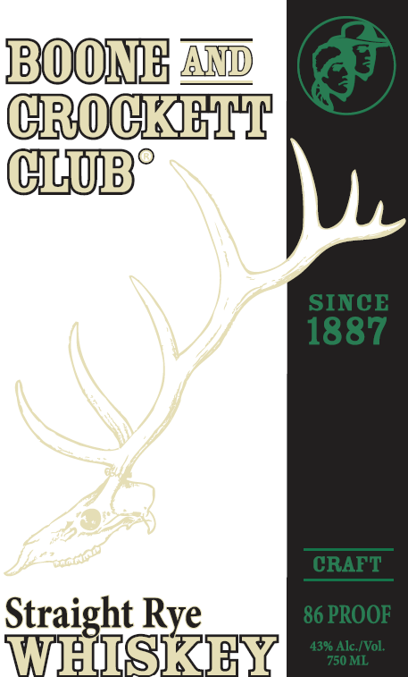

# TTB COLA Label Images - TTBID 26217001000647

**Brand Name:** BOONE & CROCKETT CLUB STRAIGHT RYE WHISKEY

**Issue Date:** 08/28/2026

**Origin Code:** 06

**Product Class/Type:** 102

**Source:** [TTB Public COLA Registry](https://ttbonline.gov/colasonline/viewColaDetails.do?action=publicFormDisplay&ttbid=26217001000647)

## Label Images

### Back Label

### Front Label

## Extracted Label Text

*Text extracted via OCR - may contain errors*

**Detected Age:** 4 Years

### Back Label

BOONE AND CROCKETT CLUB
FAIR CHASE & CONSERVATION
SINCE 1887
he first environmental revolution in North
T hoeric
was led by sportsmen
who
were
concerned with the destruction of wildlife and
their habitats. The most notable was Theodore
Roosevelt; who formed the Boone and Crockett
Club in 1887. The Club pioneered a new
for the proper use and management of wild natural
resources, simply known
as S
'conservation:
North American sportsmen remain the driving
force behind the most successful system of wildlife
conservation in the world that is
responsible for
the incredible abundance  of wildlife and wild
places all people enjoy:
To learn more, please visit:
www BooneandCrockettWhiskey com
Aged 4 Years
New Oak Barrels
Produced for Prestige Imports LLC, Mt: Clemens, MI
by Lone Light Spirits LLC, Ferndale; MI
Please Drink Responsibly
PLEASE RECYCLE
34650
00630
ME
VT REF .1Sc
IA.05c
GOVERNMENT WARNING:
ACCORDING TO THE SURGEON GENERAL, WOMEN
SHOULD NOT DRINK ALCOHOLIC BEVERAGES DURING PREGNANCY BECAUSE OF THE
RISK OF BIRTH DEFECTS. (2) CONSUMPTION OF ALCOHOLIC BEVERAGES IMPAIRS YOUR
ABILITY TO DRIVE A CAR OR OPERATE MACHINERYAND MAY CAUSE HEALTH PROBLEMS.
LABEL PRINTS IN WHITE FONT
Straight Rye Whiskey_Back Label_Black indd
5/18/18
5.13 PM
system
today

### Front Label

CROCK rsh
CUBE
Straight Rye
WES KEN
