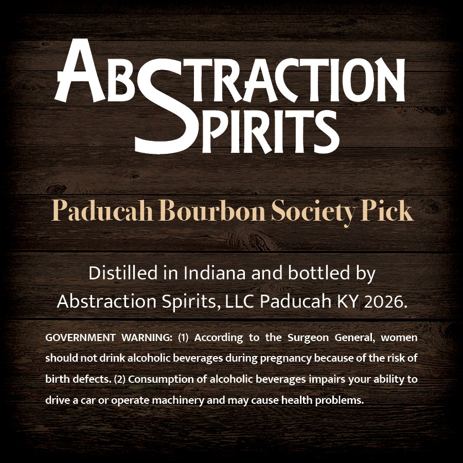
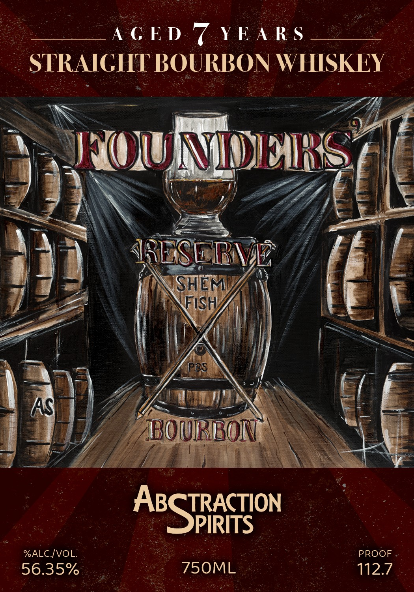

# TTB COLA Label Images - TTBID 26217001000778

**Brand Name:** ABSTRACTION SPIRITS

**Fanciful Name:** FOUNDERS RESERVE

**Issue Date:** 08/12/2026

**Origin Code:** 22

**Product Class/Type:** 101

**Source:** [TTB Public COLA Registry](https://ttbonline.gov/colasonline/viewColaDetails.do?action=publicFormDisplay&ttbid=26217001000778)

## Label Images

### Back Label

### Front Label

## Extracted Label Text

*Text extracted via OCR - may contain errors*

**Detected Proof:** 112.7

### Back Label

TRACTION

ABS

PIRITS

Paducah Bourbon Society Pick

Distilled in Indiana and bottled by

Abstraction Spirits, LLC Paducah KY 2026.

GOVERNMENT WARNING: (1) According to the Surgeon General, women

should not drink alcoholic beverages during pregnancy because of the risk of

birth defects. (2) Consumption of alcoholic beverages impairs your ability to

drive a car or operate machinery and may cause health problems.

### Front Label

A G ED 7 YE A R $
STRAIGHT BOURBON WHISKEY
UNOJUUNINIMRRIS
JSESLRVE
SHEM
FIsH
p1S
AS
BOURBON
ABSTFRCoN
%ALCIVOL:
PROOF
56.35%
750ML
112.7
