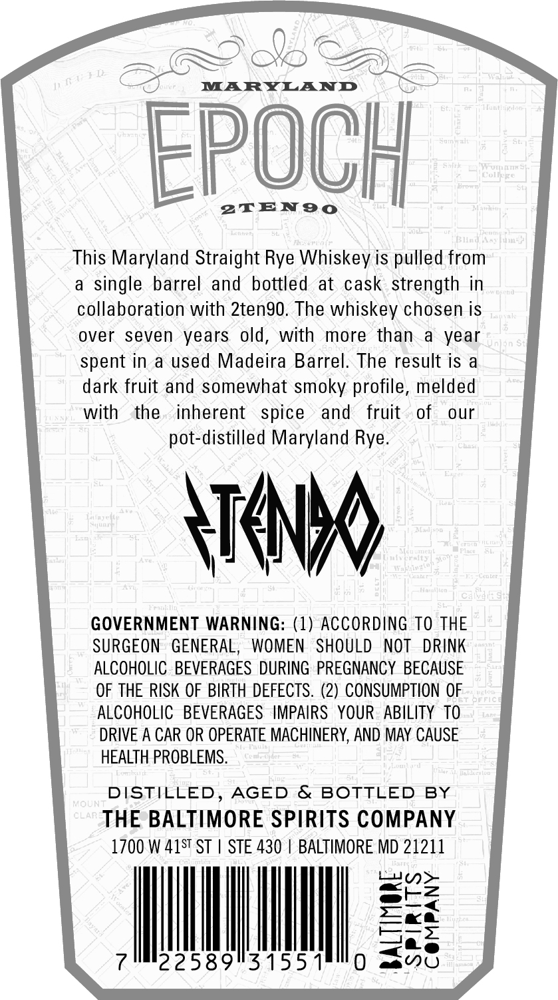
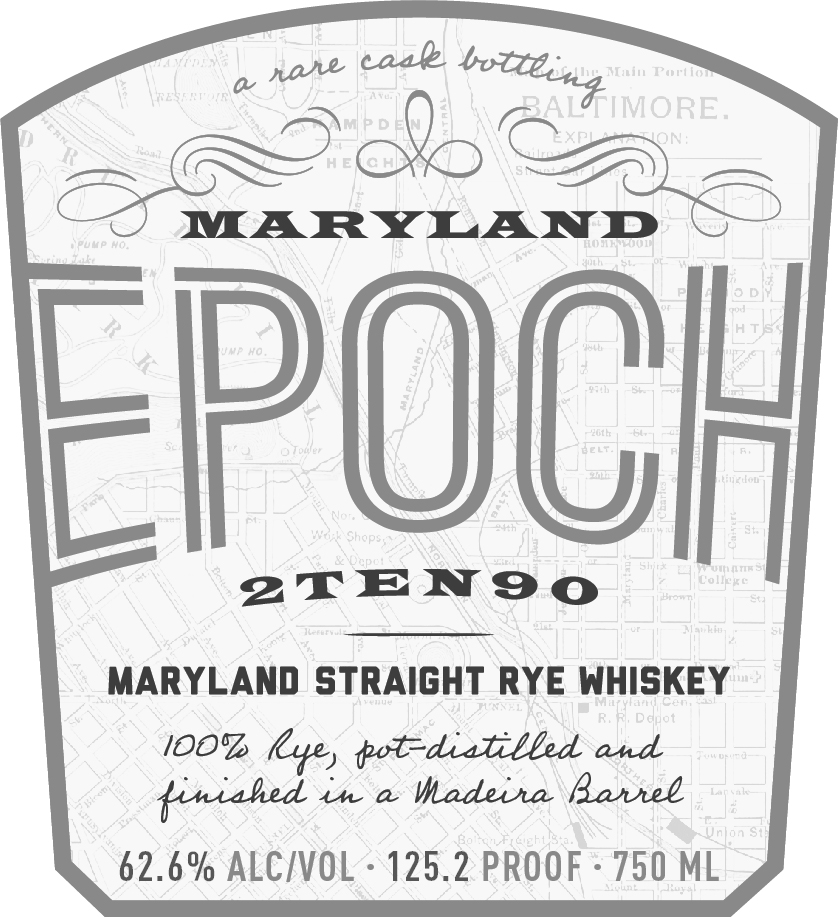

# TTB COLA Label Images - TTBID 26218001000096

**Brand Name:** EPOCH

**Issue Date:** 08/12/2026

**Origin Code:** 25

**Product Class/Type:** 101

**Source:** [TTB Public COLA Registry](https://ttbonline.gov/colasonline/viewColaDetails.do?action=publicFormDisplay&ttbid=26218001000096)

## Label Images

### Back Label

### Front Label

### Label 3

## Extracted Label Text

*Text extracted via OCR - may contain errors*

*1 image(s) excluded: text did not meet readability threshold*

**Detected Proof:** 125.2

### Back Label

MARYLAND
EpOCH
YJm
2TEn9o
This Maryland Straight Rye Whiskey is pulled from
single barrel and bottled
at cask strength in
collaboration with 2tengo. The whiskey chosen is
over
seven
years
old,
with
more than
year
spent in
a used Madeira Barrel. The result is
dark fruit and somewhat smoky profile, melded
with
the
inherent
spice
and
fruit
of
our
pot-distilled Maryland Rye.
ATNK
GOVERNMENT WARNING: (1) ACCORDING TO THE
SURGEON
GENERAL,
WOMEN
SHOULD
NOT
DRINK
ALCOHOLIC BEVERAGES DURING  PREGNANCY BECAUSE
OF THE RISK OF BIRTH DEFECTS. (2) CONSUMPTION OF
ALCOHOLIC   BEVERAGES   IMPAIRS   YOUR  ABILITY TO
DRIVE A CAR OR OPERATE MACHINERY, AND MAY CAUSE
HEALTH PROBLEMS.
DISTILLED _
AGED
& BOTTLED BY
NOlN:
CLAR
THE BALTIMORE SPIRITS COMPANY
1700 W 41ST ST
STE 430
BALTIMORE MD 21211
U)
2
2258913155
11[ 1 ' L

### Front Label

caal
Main Fortnon
BAL
O
MARYLAND
FPOO
351]/gW
3(TIF >
CoU
2TEN9o
MARYLANd StrAIGHT RYE WHISKEY
Doyot
IOOT (Lye) tot-diatilbed and
4 '( 0i'~ 'J
tiniahed
Lh
a
Vadeiha Bavtel
Jnlon $:
62.6 % ALCIVOL
125.2 PROOF
750 ML
botteind MORE.
nahe
