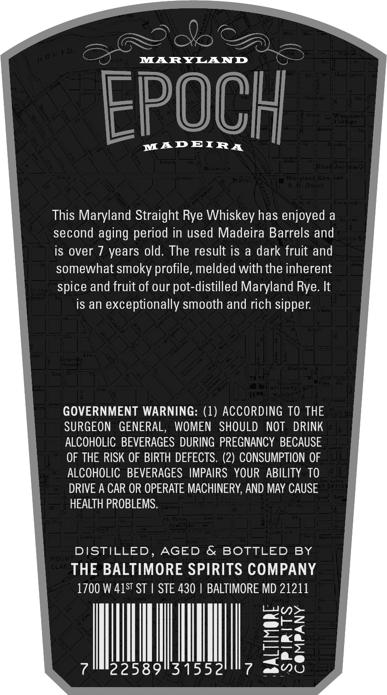
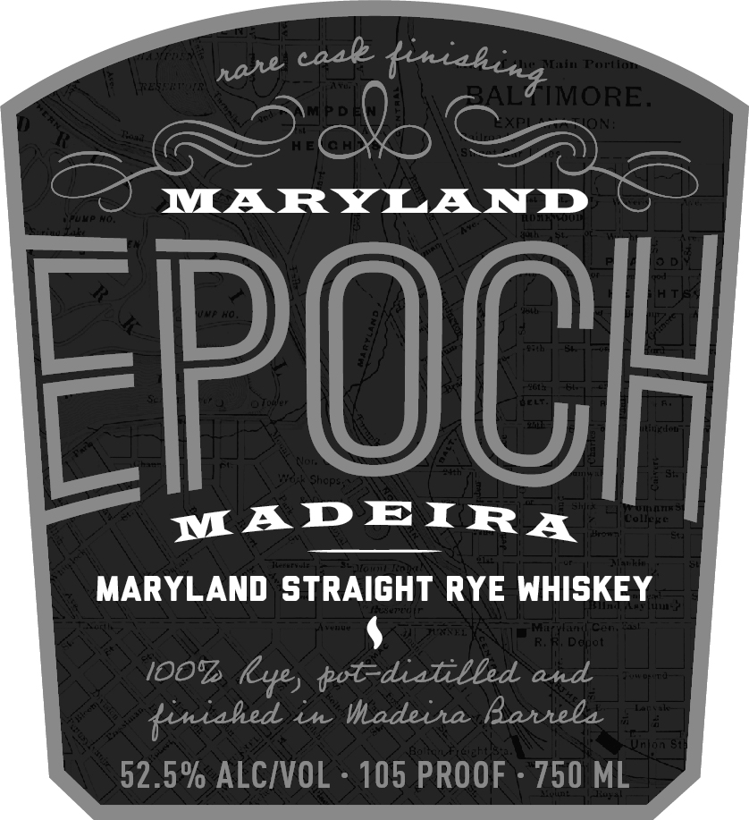

# TTB COLA Label Images - TTBID 26218001000098

**Brand Name:** EPOCH

**Issue Date:** 08/12/2026

**Origin Code:** 25

**Product Class/Type:** 102

**Source:** [TTB Public COLA Registry](https://ttbonline.gov/colasonline/viewColaDetails.do?action=publicFormDisplay&ttbid=26218001000098)

## Label Images

### Back Label

### Front Label

### Label 3

## Extracted Label Text

*Text extracted via OCR - may contain errors*

*1 image(s) excluded: text did not meet readability threshold*

**Detected Proof:** 105

### Back Label

MARYLAND
4[  / |
EPOCH
ouuugs
MADEIRA
Rsit ,8 -1 - `
Ritilai
snn
1h | ^ ` 0
This Maryland Straight Rye Whiskey has enjoyed a
second aging period in used Madeira Barrels and
is over
years old. The result is
a dark fruit and
somewhat smoky profile, melded with the inherent
spice and fruit of our pot-distilled Maryland Rye. It
is an exceptionally smooth and rich sipper
1
Wa
7774| LiL( [
GOVERNMENT WARNING: (1) ACCORDING TO THE
SURGEON   GENERAL,
WOMEN   SHOULD
NOT   DRINK
ALCOHOLIC BEVERAGES DURING PREGNANCY BECAUSE
OF THE RISK OF BIRTH DEFECTS. (2) CONSUMPTION OF
ALCOHOLIC   BEVERAGES IMPAIRS   YOUR ABILITY TO
DRIVE A CAR OR OPERATE MACHINERY, AND MAY CAUSE
HEALTH PROBLEMS
~( [&
S
DISTILLED
AGED & BOTTLED BY
MoM
_n
THE BALTIMORE SPIRITS COMPANY
1700 W 41ST ST
STE 430
BALTIMORE MD 21211
2
2
22589131552
0
3

### Front Label

Mcacddl
Fudteu
BAL
TMORE.
ON
MARYLAND

FPOCI
Je
Shcp

MADEIRA
#ollee
MARYLAND STRAIGHT RYE WHISKEY
MIZtlet C "=
Deuot
IOO'
lLye, tot-dialilbed and
4[ Vi T '_
tiniahed
Madeiha Battela
unons
52.5% ALCIVOL
105 PROOF
750 ML
caal
tiniahina
nase
