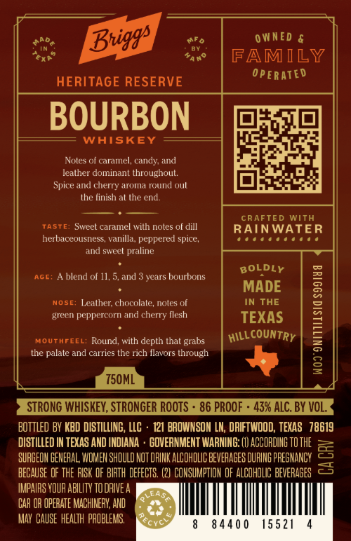
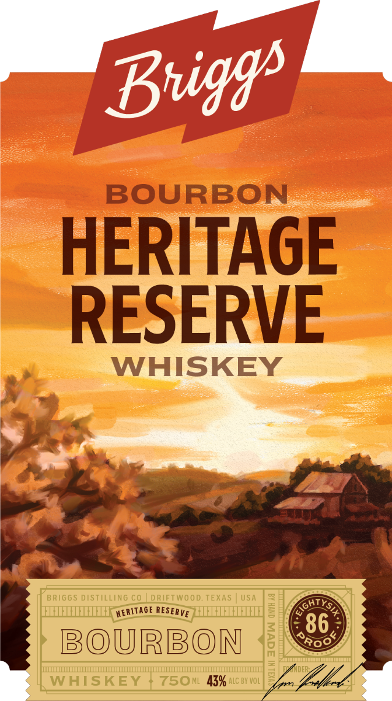

# TTB COLA Label Images - TTBID 26218001000159

**Brand Name:** BRIGGS DISTILLING CO.

**Fanciful Name:** HERITAGE RESERVE BOURBON WHISKEY

**Issue Date:** 08/17/2026

**Origin Code:** 44

**Product Class/Type:** 141

**Source:** [TTB Public COLA Registry](https://ttbonline.gov/colasonline/viewColaDetails.do?action=publicFormDisplay&ttbid=26218001000159)

## Label Images

### Back Label

### Front Label

## Extracted Label Text

*Text extracted via OCR - may contain errors*

**Detected Proof:** 86

### Back Label

0 WNED &
FAMILY
0pERATED
HERITAGE RESERVE
BOURBON
WAISKEY
Nules of caramnel, candy and
leather dominant throughout
Spice and cherry aroma round oul
the finish al the end:
CRAFTED
WITH
Taste:
Swcct caramel with noles of dill
RAINWATER
herbaceousness, vanilla; peppered spice,
and swveel
praline
BOLDLY
AGE;
blend of 11,5,and
years bourbons
MADE
NOSE: Lealher; chocolale, noles of
IN THE
green peppercorn and cherry Ilesh
TEXAS
L
MOUTHFEEL; Round; with depth that grabs
thc palate and carrics thc rich flavors through
8
750ML
STRONG WHISKEY, STRONGER ROoTs
86 PROOF
43% ALC. BY VOL_
BottLed BV KBD DISTILLING, LLC
121 BROWNSOH LK; DRIFTWOOD; TEXAS   78619
DISTILLED IN TEXAS AND INDIANA
GOVERNMENT WARNIHG; (I) ACCORDIHG TO THE
SURGEOH GENEFAL WOMEN SHOULD NOT DRINK ALCOHOLG BEVEFAGES DURING PREGHANCY
5
BECAUSE oF THE RISK dF BIRTH DEFECTS; (2) COHSUMPTIOH OF ALCOHOLIC BEVERAGES
IMPAIRS VOUR ABILITY TODAIVEA
LEAS
CAR OR OPERATE MACHINERY; AND
MAY CauSe HEALTh  PAOBLEMS,
8440 0
15521
Bviggp
countRY
HILLO
Rcyc

### Front Label

Buigg -
BOURBON
HERITAGE
RESERVE
WHISKEY
B RIGG S DISTILLING C0
DRIFTWO O D,TEXAS
USA
YS
5
86
BOURBON
5
R0
WHISKEY
750m1   43%6 ALC BY VOL'
GHF
HERITAGE
RESERVE
