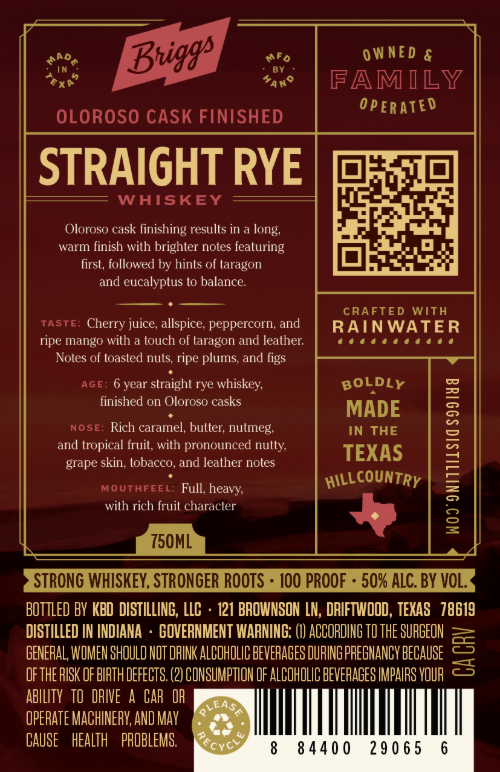
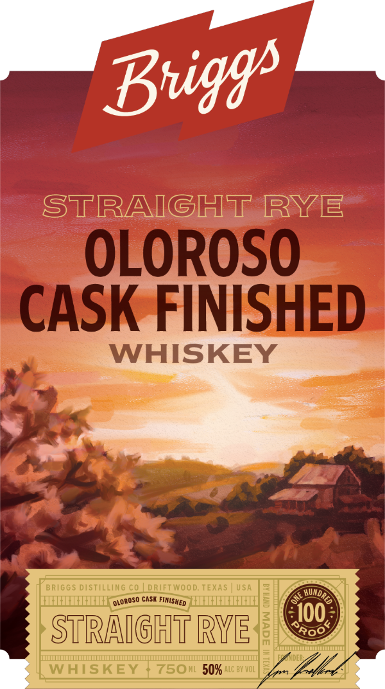

# TTB COLA Label Images - TTBID 26218001000161

**Brand Name:** BRIGGS DISTILLING CO.

**Issue Date:** 08/17/2026

**Origin Code:** 44

**Product Class/Type:** 102

**Source:** [TTB Public COLA Registry](https://ttbonline.gov/colasonline/viewColaDetails.do?action=publicFormDisplay&ttbid=26218001000161)

## Label Images

### Back Label

### Front Label

## Extracted Label Text

*Text extracted via OCR - may contain errors*

**Detected Proof:** 100

### Back Label

0 WNED &
FAMILY
0pERATED
OLOROSO CASK FINISHED
STRAIGHT RYE
WAISKEY
Oloroso cask finishing resulls in
warm finish with brighter notes fcaturing
first, followed by hints of laragon
and eucalyplus lo balance:
CRAFTED
WITH
Taste:
Cherry juice; allspice peppercorn; and
RAINWATER
ripe mango with
touch of taragon and leather
Noles of loasled nuts ripe plums and ligs
AGE=
year slraight rye whiskey;
BOLDLY
finished on Oloroso casks
MADE
NOSE: Rich caramel; buller; nutmeg.
IN THE
and tropical Iruil , wilh pronounced nully
TEXAS
L
grape skin lobacco; and Ieather noles
MOUTHFEEL; Full, heawy
wilh rich Iruil characler
8
750ML
STRONG WHISKEY, STRONGER ROoTs
100 PROOF
50% ALC. BY VOL_
Bottled BY KBD DISTILLING, LLC
121 BROWNSON LN; DRIFTWOOD , TEXAS   78619
DISTILLED
INDIANA
GOVERNMENT WARNING: (I1 ACCORDIHG TD THE SUAGEON
GENERAL WOMEN shouLd NOT DAINK ALCOHOLIC BEVERAGES OURING PREGHANCY BEGAUSE
3
oFTHE RISK of BIRTH DEFECTS
CONSUMPTIOH OF ALCOHOLIC BEvEAAgES IMPAIRS YQUR
ABILITY   tO DRIE
CAR  OH
LEAS
OPERATE MACHINERY; AND MAy
CAUSe
health   PROBLEMS:
8 440 0
290 65
Briggs |
Jong
~countRy
HILLO
Rcnc

### Front Label

STRAIGHT RYE
OLOROSO
CASK FINISHED
WHISKEY
BRIG G 5 distilLiNG CQ
dRIFTWood; TEXAS
USA
CaSK
3
100
STRAIGHT RYE
50
WHISKEY
7501L50% ALC BY Vol
Buiggs
HundR
OLoROSO
FIMISHED
