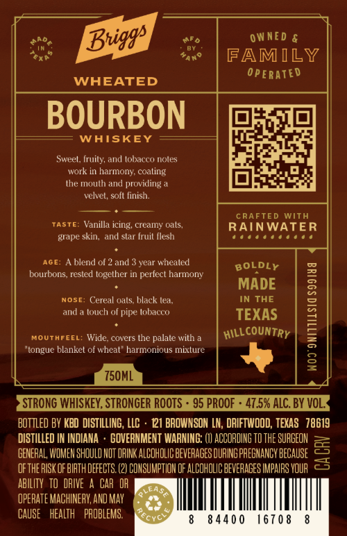
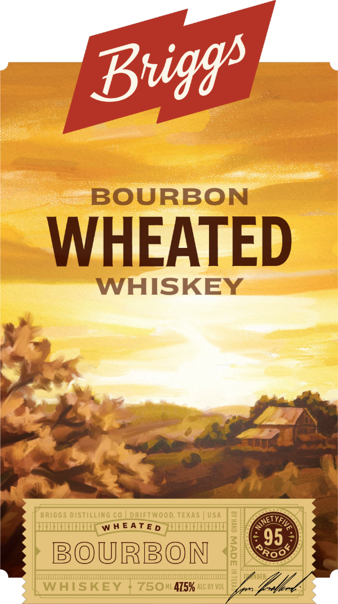

# TTB COLA Label Images - TTBID 26218001000163

**Brand Name:** BRIGGS DISTILLING CO.

**Issue Date:** 08/17/2026

**Origin Code:** 44

**Product Class/Type:** 101

**Source:** [TTB Public COLA Registry](https://ttbonline.gov/colasonline/viewColaDetails.do?action=publicFormDisplay&ttbid=26218001000163)

## Label Images

### Back Label

### Front Label

## Extracted Label Text

*Text extracted via OCR - may contain errors*

**Detected Proof:** 95

### Back Label

0W NED &
FAMILY
0 PERATED
WHEATED
BOURBON
WAISKEY
Sweel, fruity, and tobacco noles
work in harmony coating
Ihe mouth and
providing
velvel; soft finish:
CRAFTED With
TASTE: Vanilla
creamy oals,
RAINWATER
grape skin,  and star fruit Ilesh
AGE-
blend ol 2 and
year whealed
BOLDLY
bourbons, rested logether in perlect harmony
MADE
NOSE: Cereal oals black lea;
IN THE
1
and
touch of pipe lobacco
TEXAS
MOUTAFEEL:
covers the palate with
hilLe
"tonguc blanket of whcal
harmonious mixturc
8
750ML
STRONG WHISKEY, STRONGER ROoTs
95 PROOF
47.5% ALC. BY VOL_
Bottled BY KBD DISTILLING, LLC
121 BROWNSON LN, DRIFTWOOD; TEXAS   78619
DISTILLED
INDIANA
GOVERNMENT WARNING: (I1 ACCORDIHG TD THE SUAGEON
GENERAL, WOMEN SHOULO MOT OFINK ALCOHOLIC BEVEFAGES DURING PREGHANCY bECauSE
5
oFTHE RISK OF BIATH DEFECTS (2) COHSUMPTIOH oF ALCOHOLIC BEVEAAGES IMPAIRS YOUR
AbILITy   tO DRIVE
CAR  OH
LEAS
OPERATE MACHINERY; AND May
CAUSe
health   PROBLEMS:.
8 440 0
167 0 8
Bniggs
icing,
countRy
Wide;
Rcnc

### Front Label

BOURBON
WHEATED
WHISKEY
BRIGGS distilLinG C0
dRIFTWOOd; TEXAS
USA
W H E AT E D
8
Fll
95
BOURBON
1
Roo
WHISKEY
750M1475% ALC BY Vol
Buiggs
