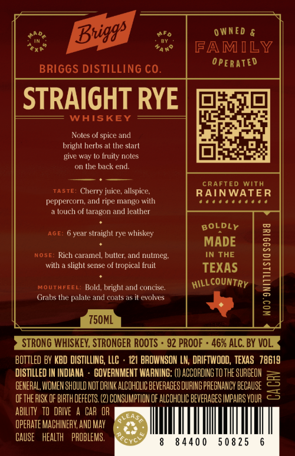
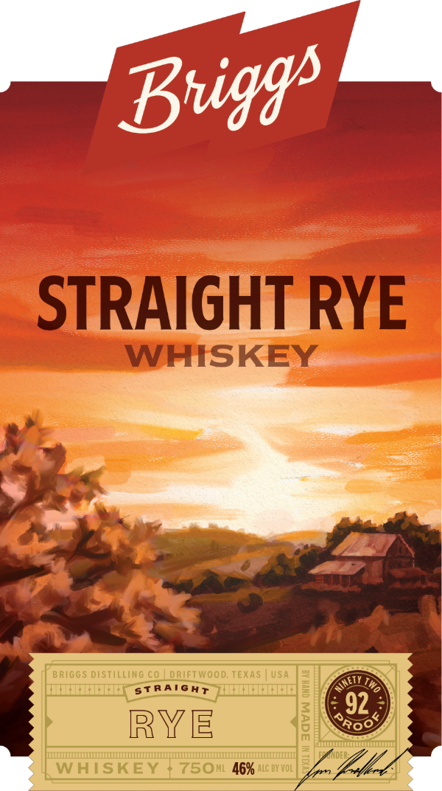

# TTB COLA Label Images - TTBID 26218001000166

**Brand Name:** BRIGGS DISTILLING CO.

**Issue Date:** 08/17/2026

**Origin Code:** 44

**Product Class/Type:** 102

**Source:** [TTB Public COLA Registry](https://ttbonline.gov/colasonline/viewColaDetails.do?action=publicFormDisplay&ttbid=26218001000166)

## Label Images

### Back Label

### Front Label

## Extracted Label Text

*Text extracted via OCR - may contain errors*

**Detected Proof:** 92

### Back Label

0 WNED &
FAMILY
OpERateD
BRIGGS DISTILLING CO.
STRAIGHT RYE
WHISKEY
Noles ol spice and
bright herbs at the start
give way lo fruily noles
the back end:
CRAFTEd
With
TastE:
Cherry juice, allspice;
RAINWATER
peppercorn; and ripe mango with
louch of taragon and leather
BOLDLY
AGE:
year straight rye whiskey
MADE
NOSE: Rich caramel; butter; and nutmeg:
IN THE
with
slight sense of tropical fruit
TEXAS
1
MOUTHFEEL
Rold, bright ard conicise.
HillcountRY
Grabs Ihe Palale and coals as
evolves
:
750ML
STRONG WHISKEY, STRONGER RooTS
92 PROOF
462 ALC BY VOL
BOTTLed BY KBD DISTILLING, LLC
121 BAOWNSON LN; DRIFTWOOD,  TEXAS   78619
DISTILLED IH INDIAHA
COVERNMENT WARNING:
ACCORDING TO THE SURGEOH
GEHERAL, WOMEN SHQULD NOT DRINK ALCOHOLIC BEVERAGES DURING PREGNANCY BECAUSE
3
ofthe bISK oF BIRTH dEfEcts (2) CONSUMPTION OF ALCOHOLIC BEVERAGES IMPAIFS VOUR
ABILITY   TD DAIVE
CAR  OR
LBA;
OPERATE MACHINEAK AND May
CAUSE
HeALTH   PROBLEMS ,
Cvc
8 440 0
5 0 8 25
Buiggs

### Front Label

STRAIGHT RYE
WHISKEY
BRIGGS distiLLING C0
driFTWOOd; TEXAS
USA
St RAIGHT
3
92
RYE
{
Ro
WHISKEY
7501146% ALC BY VoL
Buiggs
