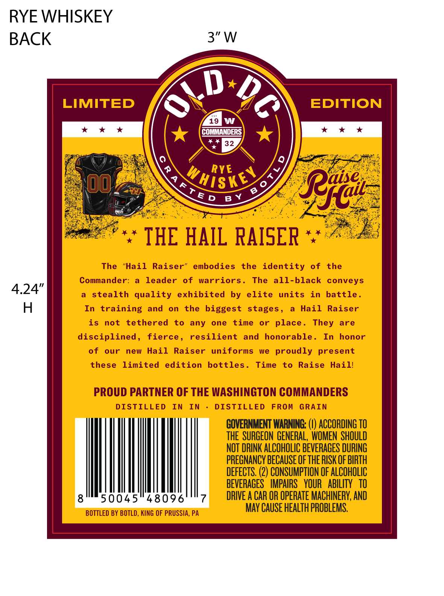
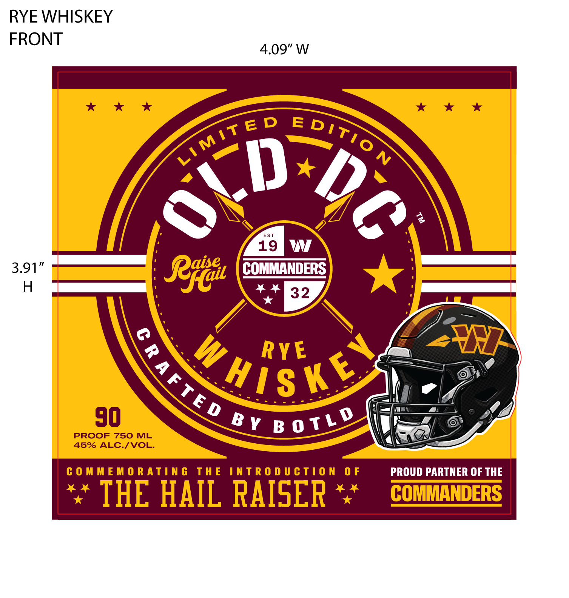

# TTB COLA Label Images - TTBID 26218001000170

**Brand Name:** OLD DC

**Issue Date:** 08/13/2026

**Origin Code:** 39

**Product Class/Type:** 142

**Source:** [TTB Public COLA Registry](https://ttbonline.gov/colasonline/viewColaDetails.do?action=publicFormDisplay&ttbid=26218001000170)

## Label Images

### Back Label

### Front Label

## Extracted Label Text

*Text extracted via OCR - may contain errors*

**Detected Proof:** 90

### Back Label

1
LIMITED
EDITION
19
W
COMMANDERS
4432
RYE
7
whiske)
K
4
0
6
"Rral
THE HAIL RAISER
The
"Hail
Raiser"
embodies
the identity
of
the
Commander:
leader
of
warriors.
The
all-black conveys
stealth quality
exhibited
by elite
units
in
battle _
In training
and
on
the
biggest stages _
Hail
Raiser
is
not
tethered
to
any
one
time
or
place .
are
disciplined ,
fierce ,
resilient
and
honorable _
In
honor
of
our
new
Hail
Raiser
uniforms
we
proudly
present
these
limited
edition
bottles.
Time
to
Raise
Haill
PROUD PARTNER OF THE WASHINGTON COMMANDERS
DISTILLED
In
In
DISTILLED
FROM
GRAIN
GOVERNMENT WARNING:
ACCORDING TO
THE   SURGEON GENERAL, WOMEN  SHOULD
NOT DRINK ALCOHOLIC BEVERAGES DURING
PREGNANCY BECAuSE Ofthe RISK OF BIRTH
DEFECTS. (2) CONSUMPTION OF ALCOHOLIC
BEVERAGES   IMPAIRS   YOUR   ABILITY   TO
8
50045"48096
7
DRIVE A CAR OR OPERATE MACHINERY; AND
BOTTLED BY BOTLD, KING OF PRUSSIA, PA
May CAUSE HEALTh PROBLEMS,
2
ATN
T E D
B Y
They

### Front Label

RYE WHISKEY
FRONT

L
45% ALC./VOL.

COMMEMORATING THE INTRODUCTION OF

*’ THE HAIL RAISER *"

PROUD PARTNER OF THE

COMMANDERS
