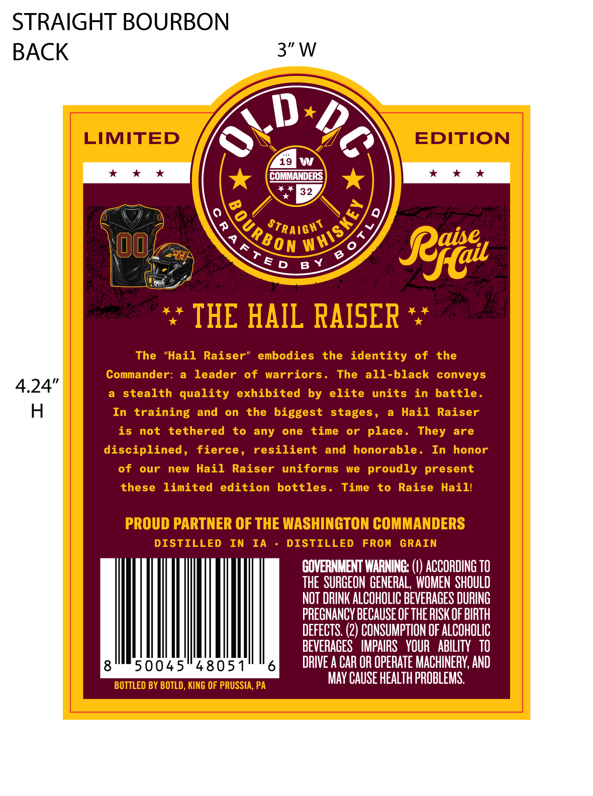
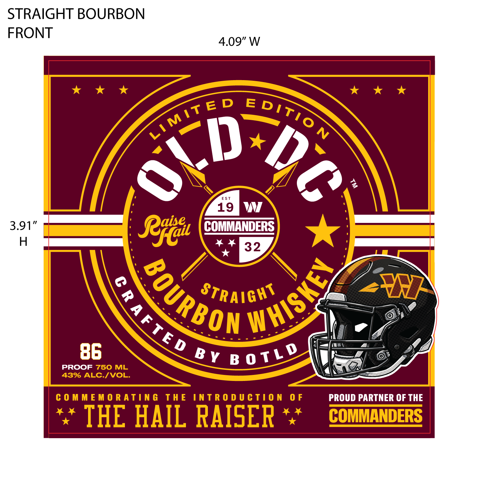

# TTB COLA Label Images - TTBID 26218001000174

**Brand Name:** OLD DC

**Issue Date:** 08/13/2026

**Origin Code:** 39

**Product Class/Type:** 101

**Source:** [TTB Public COLA Registry](https://ttbonline.gov/colasonline/viewColaDetails.do?action=publicFormDisplay&ttbid=26218001000174)

## Label Images

### Back Label

### Front Label

## Extracted Label Text

*Text extracted via OCR - may contain errors*

**Detected Proof:** 86

### Back Label

LIMITED
EDITION
19
M
COMMANDERS
4432
0
0
StrAight
7
K
4
0
6
Rfil
IHE HAIL RAISER
The
"Hail
Raiser"
embodies
the identity
of
the
Commander:
leader
of
warriors .
The
all-black conveys
stealth quality
exhibited
by elite
units
in
battle .
In training and
on
the
biggest stages,
Hail
Raiser
is
not
tethered
to
any
one
time
or
place .
are
disciplined,
fierce ,
resilient
and
honorable .
In
honor
of
our
new
Hail
Raiser
uniforms
we
proudly present
these
limited
edition
bottles .
Time
to
Raise
Haill
PROUD PARTNER OF THE WASHINGTON COMMANDERS
DISTILLED
In
IA
DISTILLED
FROM
GRAIN
GOVERNMENT WARNING:
ACCORDING TO
THE   SURGEON GENERAL,  WOMEN   SHOULD
NOT DRINK ALCOHOLIC BEVERAGES DURING
PRECNANCY BECAUSE OF THE RISK OF BIRTH
DEFECTS. (2) CONSUMPTION OF ALCOHOLIC
BEVERAGES   IMPAIRS   YOUR   ABILITy   TO
8
50045"48051
6
DRIVE A CAR OR OPERATE MACHINERY, AND
BOTTLED BY BOTLD , KING OF PRUSSIA, PA
MAY CAUSE HEALTH PROBLEMS:
WhISKEY
#OURBOR
T E D
B Y
They

### Front Label

E
EST
19
Rgtal
COMMANDERS
32
STRAIGHT
TNF
86
PROOF
750 ML
43% ALC.IVOL:
C 0 M M € M 0 R ATIN G
TH E
INTR 0 D U € TI 0 N
0 F
PROUD PARTNER OF THE
THE HAIL RAISER
COMMANDERS
MiT E D
5itiO N
Oii
2
WHISKEY
BoURBon
SrB0v76/7
