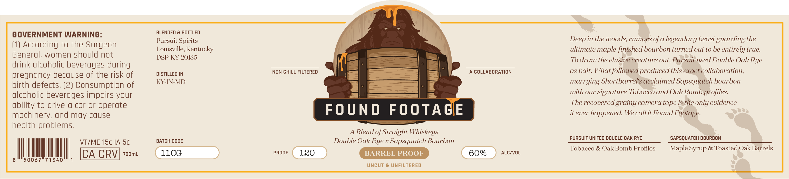
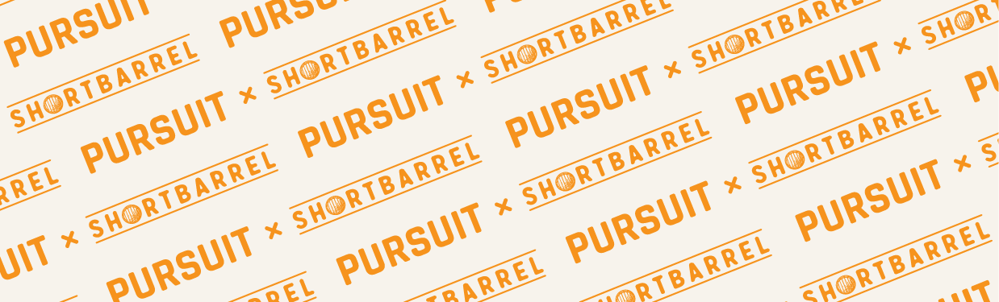

# TTB COLA Label Images - TTBID 26218001000197

**Brand Name:** PURSUIT

**Fanciful Name:** FOUND FOOTAGE

**Issue Date:** 08/13/2026

**Origin Code:** 22

**Product Class/Type:** 121

**Source:** [TTB Public COLA Registry](https://ttbonline.gov/colasonline/viewColaDetails.do?action=publicFormDisplay&ttbid=26218001000197)

## Label Images

### Label 1

### Label 2

## Extracted Label Text

*Text extracted via OCR - may contain errors*

**Detected Proof:** 180

### Label 1

GOVERNMENT WARNING:
BLENDED & BOTTLED
Pursuit Spirits
Deep in the woods, rumors of a legendary beast guarding the
(1) According to the Surgeon
Louisville, Kentueky
ultimate maple-finished bourbon turned out to be entirely true:
General, women should not
DSP-KY-20135
To draw the elusive ereature out; Pursuit used Double Oak Rye
drink alcoholic beverages during
DISTILLED IN
NON CHILL FILTERED
COLLABORATION
aS
bait: What followed produeed this exaet eollaboration,
pregnancy because of the risk of
KY-IN-MD
marrying Shortbarrel's aeelaimed Sapsquateh bourbon
birth defects. (2) Consumption of
alcoholic beverages impairs your
with our signature Tobaeeo and Oak Bomb profiles:
ability to drive 0 car or operate
The reeovered grainy eamera tape is the only evidenee
machinery, und may cause
FOUND
FOOTA GIE
it ever happened We eallit Found Footage:
health problems;
A Blend of Straight Whiskeys
VTIME 154 IA 5c
BATCH CODE
Double Oak
X
Sapsquateh Bourbon
PURSUIT UNITED DOUBLE OAK RYE
SAPSQUATCH BOURBON
Tobaceo
Oak Bomb Profiles
Maple Syrup & Toasted Oak Barrels
CA CRV
7o0mL
11CG
PROOF
180
BARREL PROOF
60%
ALCIVOL
50067//71340
uncut & UNFILTERED
Rye -

### Label 2

Pl
S
El
PURSUM
PURBU
SHORIBARRLL
SHORIBARL
SHOR
SHORIBARREL
SHORIBARREL
PURSUIT
PURSUIT
PURSUIT
PURSUIT
SHORIBARREL
SHORIBARREL
SHORIBARREL
SHORIBARREL
PURSUIT
RE
PURSUIT
PURSUIT
TORIBARREL
PURSUIT
RTBARREL
nit
TTRREL
