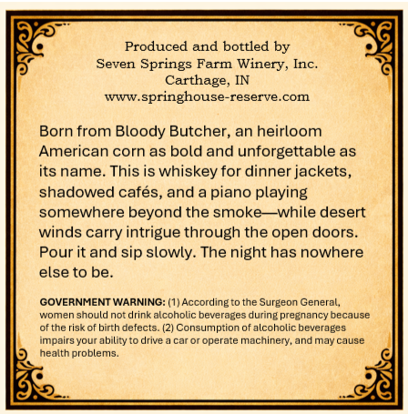
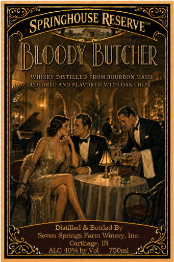

# TTB COLA Label Images - TTBID 26218001000210

**Brand Name:** SPRINGHOUSE RESERVE

**Fanciful Name:** BLOODY BUTCHER

**Issue Date:** 08/20/2026

**Origin Code:** 19

**Product Class/Type:** 140

**Source:** [TTB Public COLA Registry](https://ttbonline.gov/colasonline/viewColaDetails.do?action=publicFormDisplay&ttbid=26218001000210)

## Label Images

### Back Label

### Front Label

## Extracted Label Text

*Text extracted via OCR - may contain errors*

### Back Label

Produced and bottled by
Seven Springs Farm Winery, Inc.
Carthage_
WTV ,
springhouse-reserve.com
Born from Bloody Butcher, an heirloom
American corn as bold and unforgettable as
its name: This is whiskey for dinner jackets
shadowed cafes, and a piano playing
somewhere beyond the smoke
while desert
winds carry intrigue through the open doors
Pour it and sip slowly: The night has nowhere
else to be:
GOVERNMENT WARNING: (1) According
the Surgeon General,
women should not drink alcoholic beverages during pregnancy because
of the riske
birth defects: (21 Consumption of alcoholic beverages
impairs your ability to drive
care
operate machinery, and may cause
health
problems.

### Front Label

IBloody BuTCher
WHISKY DISTILLED FROM BOURBON MASH
COLORED AND FLAVORED WITH OAK CHIPS
Distilled & Bottled By
Seven Springs Farm
Ine:
Carthage, IN
ALC 40%o by Vol
750m
SPRINGHOUSE
RESERVE "
Winery,
