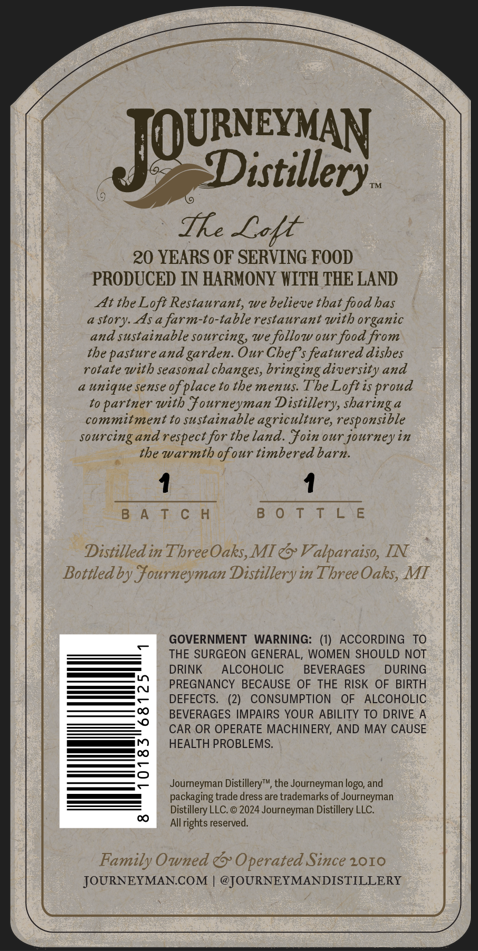
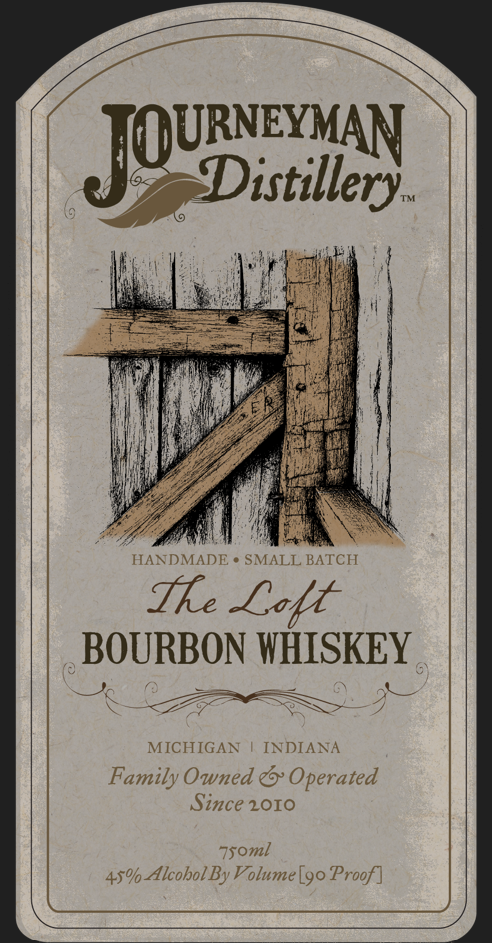

# TTB COLA Label Images - TTBID 26218001000224

**Brand Name:** JOURNEYMAN DISTILLERY

**Fanciful Name:** THE LOFT BOURBON WHISKEY

**Issue Date:** 08/21/2026

**Origin Code:** 06

**Product Class/Type:** 141

**Source:** [TTB Public COLA Registry](https://ttbonline.gov/colasonline/viewColaDetails.do?action=publicFormDisplay&ttbid=26218001000224)

## Label Images

### Back Label

### Front Label

## Extracted Label Text

*Text extracted via OCR - may contain errors*

**Detected Proof:** 90
**Detected Age:** 20 Years

### Back Label

JQUDisxillay
Tke Latt
20 YEARS OF SERVING FOOD
PRODUCED IN HARMONY WITH THE LAND
At the Loft Restaurant; we believe that food has
a story As a farm-to-table restaurant with organic
sustainable sourcing; we follow our food from
the pasture and _
Our Chef s featured dishes
rotate wvith Seasonal
changes, bringing diversity and
unique Sense of place to the menus The Loftis proud
partner wvith fourneyman
Distillery, sharinga
commitment t0 Sustainable agriculture; responsible
sourcingand respect for the land. foin our journey in
the warmth ofour timbered barn:
B A T
L €
Distilledin Three Oaks,MI & Valparaiso, IN
Bottledby
ourneyman
Distillery=
in Three Oaks; MI
GOVERNMENT
WARNING: (1)
ACCORDING
THE SURGEON GENERAL; WOMEN SHOULD NOT
DRINK
ALCOHOLIC
BEVERAGES
DURING
PREGNANCY BECAUSE OF THE RISK OF BIRTH
DEFECTS:
CONSUMPTION
ALCOHOLIC
BEVERAGES IMPAIRS YOUR ABILITY TO DRIVE
CAR OR OPERATE MACHINERY; AND MAY CAUSE
HEALTH PROBLEMS_
Joumeyman Distillery"
the Journcyman logo, and
packaging trade dress are trademarks 0f Journeyman
Distillery LLC.=
2024 Journeyman Distillery LLC.
Allrights reserved
Family Owned
Operated Since 2010
JOURNEYMANCOM
@JOURNEYMANDISTILLERY
aud
garden.

### Front Label

JOUDinllay
Distillery
HANDMADE
SMALL BATCH
fke Lott
BOURBON WHISKEY
MICHIGAN
INDIANA
Family Owned &' Operated
Since 20IO
7soml
45% Alcohol By Volume [9o Proof]
