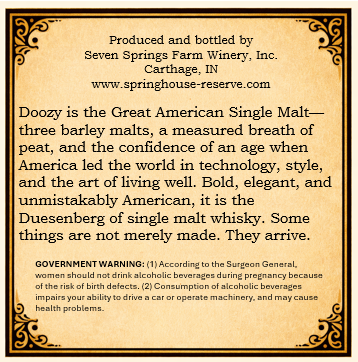
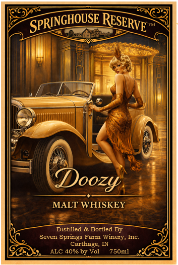

# TTB COLA Label Images - TTBID 26218001000225

**Brand Name:** SPRINGHOUSE RESERVE

**Fanciful Name:** DOOZY

**Issue Date:** 08/17/2026

**Origin Code:** 19

**Product Class/Type:** 118

**Source:** [TTB Public COLA Registry](https://ttbonline.gov/colasonline/viewColaDetails.do?action=publicFormDisplay&ttbid=26218001000225)

## Label Images

### Back Label

### Front Label

## Extracted Label Text

*Text extracted via OCR - may contain errors*

### Back Label

Produced and bottled by
Seven Springs Farm Winery, Inc_
Carthage,
springhouse-reserve com
Doozy is the Great American Single Malt
three barley malts
measured breath of
peat;
and the confidence of an age when
America led the world in technology; style_
and the art of living well.
Bold; elegant; and
unmistakably American; it is the
Duesenberg of single malt whisky.
Some
things are not merely made_
They arrive _
GOVERNMENTWARNING=
Accordinz
the Surucan General
YonerGhawlc
irinkaicohalic bovcrazes during preenanc; because
ofthe
birth delacte
umption ofalcohalic boverazos
impains youcabilt
operate Machinery-
May Cause
health problem;

### Front Label

Doozy
MALT WHISKEY
Distilled & Bottled By
Seven Springs Farm Winery
Inc.
Carthage
ALC 40% by Vol
750ml
SPRINGHOUSE
RESERVE'
