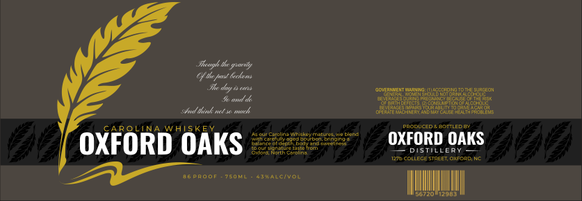

# TTB COLA Label Images - TTBID 26218001000322

**Brand Name:** OXFORD OAKS DISTILLERY

**Issue Date:** 08/12/2026

**Origin Code:** 35

**Product Class/Type:** 140

**Source:** [TTB Public COLA Registry](https://ttbonline.gov/colasonline/viewColaDetails.do?action=publicFormDisplay&ttbid=26218001000322)

## Label Images

### Label 1

## Extracted Label Text

*Text extracted via OCR - may contain errors*

### Label 1

Phcengh the gsarvty
cdx faV Kcktms
Mc day
goueraNenT
J amd
Ssd eok mtt so mck
7EEEEE2
PPODUCEDEBCHLEC E
CAROLIN
Carclina *I
Ehemalue
Jablan
OXFORD OAKS =
Stounalc5584588517953"
OXFORD OAKS
3xoorosingrthcearoltrje
STill
1274 CollecestaeeT OXFcPDN
Paoof
O50mi
6i4aicivon
