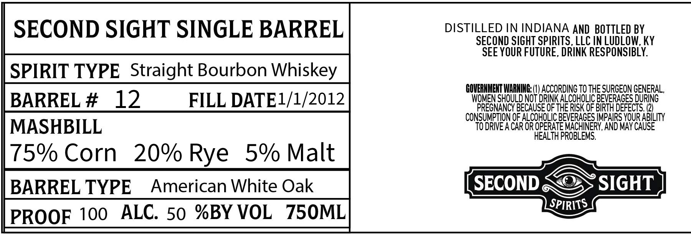

# TTB COLA Label Images - TTBID 26218001000377

**Brand Name:** SECOND SIGHT SINGLE BARREL

**Issue Date:** 08/21/2026

**Origin Code:** 22

**Product Class/Type:** 101

**Source:** [TTB Public COLA Registry](https://ttbonline.gov/colasonline/viewColaDetails.do?action=publicFormDisplay&ttbid=26218001000377)

## Label Images

### Label 1

## Extracted Label Text

*Text extracted via OCR - may contain errors*

**Detected Proof:** 100

### Label 1

SECOND SIGHT SINGLE BARREL
DISTILLED IN INDIANA AND BOTTLED BY
SECOND SIGHT SPIRITSLLC IN LUDLOW, KY
SEE YOUR FUTURE , DRINK RESPONSIBLY:
SPIRIT TYPE Straight Bourbon Whiskey
COVERNHENT WARNING (U ACCORDING To THE SURGEON GENERAL,
BARREL #
12
FILL DATEL/1/2012
WOMEN SHOULD NOT DRINK ALCOHOLIC BEVERAGES duRing
PREGNANCY BECAUSE OF THE RISK OF BIRTH DEFECTS (2)
CONSUMPTION oF ALCOHOLICBEVERAGES MMPAIRS YOUR ABILity
MASHBILL
TO DRIVE ACAR OR OPERATE MACHINERY, AND MAY CAUSE
HEALTH PROBLEMS,
75% Corn
20% Rye
5% Malt
BARREL TYPE
American White Oak
SECOND
SIGHT
SPIRITS
PROOF 100
ALC. 50 %BY VOL
75OML
