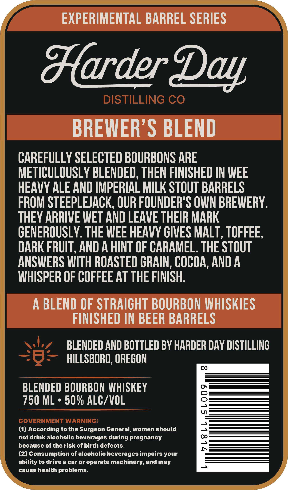
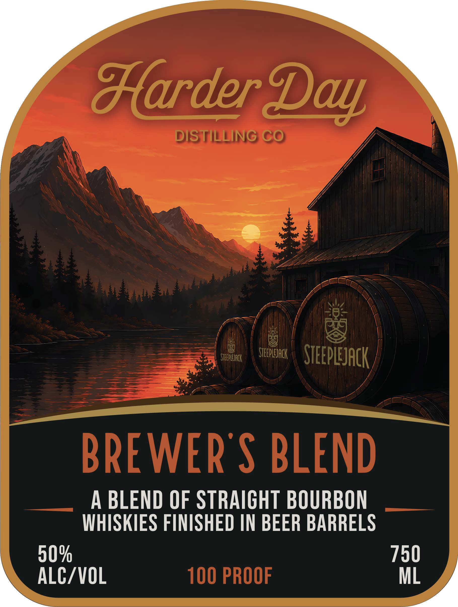

# TTB COLA Label Images - TTBID 26218001000402

**Brand Name:** BREWER'S BLEND

**Fanciful Name:** HARDER DAY DISTILLING CO

**Issue Date:** 09/10/2026

**Origin Code:** 38

**Product Class/Type:** 121

**Source:** [TTB Public COLA Registry](https://ttbonline.gov/colasonline/viewColaDetails.do?action=publicFormDisplay&ttbid=26218001000402)

## Label Images

### Back Label

### Front Label

## Extracted Label Text

*Text extracted via OCR - may contain errors*

**Detected Proof:** 100

### Back Label

EXPERIMENTAL BARREL SERIES
darder
DISTILLING CO
BREWER'S BLEND
CAREFULLY SELECTED BOURBONS ARE
METICULOUSLY BLENDED, THEN FINISHED IN WEE
HEAVY ALE AND IMPERIAL MILK STOUT BARRELS
FROM STEEPLEJACK, OUR FOUNDER'S OWN BREWERY.
THEY ARRIVE WET AND LEAVE THEIR MARK
CENEROUSLY. THE WEE HEAVY CIVES MALT
1
TOFFEE,
DARK FRUIT , AND A HINT OF CARAMEL THE STOUT
ANSWERS WITH ROASTED CRAIN , COCOA, AND A
WHISPER OF COFFEE AT THE FINISH:
A BLEND OF STRAICHT BOURBON WHISKIES
FINISHED IN BEER BARRELS
BLENDED AND BOTTLED BY HARDER DAY DISTILLINC
HILLSBORO, ORECON
BLENDED BOURBON WHISKEY
750 ML
50% ALC/VOL
8
GOVERNMENT WARNING:
(1) According to the Surgeon General, women should
not drink alcoholic beverages during pregnancy
1
because of the risk of birth defects:
(2) Consumption of alcoholic beverages impairs your
ability to drive a car or operate machinery, and may
3
cause health problems.
Day

### Front Label

darder 2
DISTILLING CO
STEEPLEJACK
STEEPLEJAcK
STEEPLEJAcK
BREWER'S BLEND
A BLEND OF STRAICHT BOURBON
WHISKIES FINISHED IN BEER BARRELS
50%
750
ALC/VOL
100 PROOF
ML
Day
