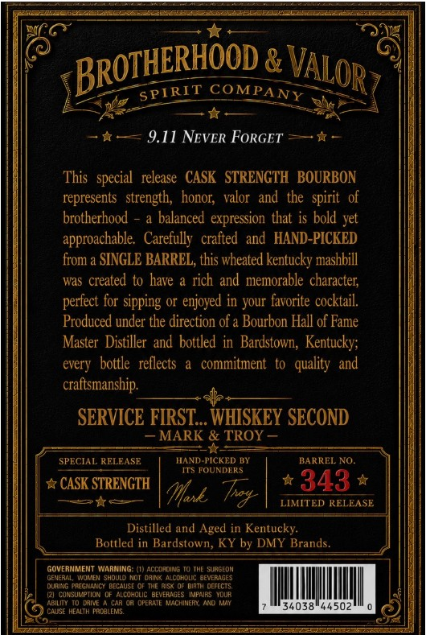
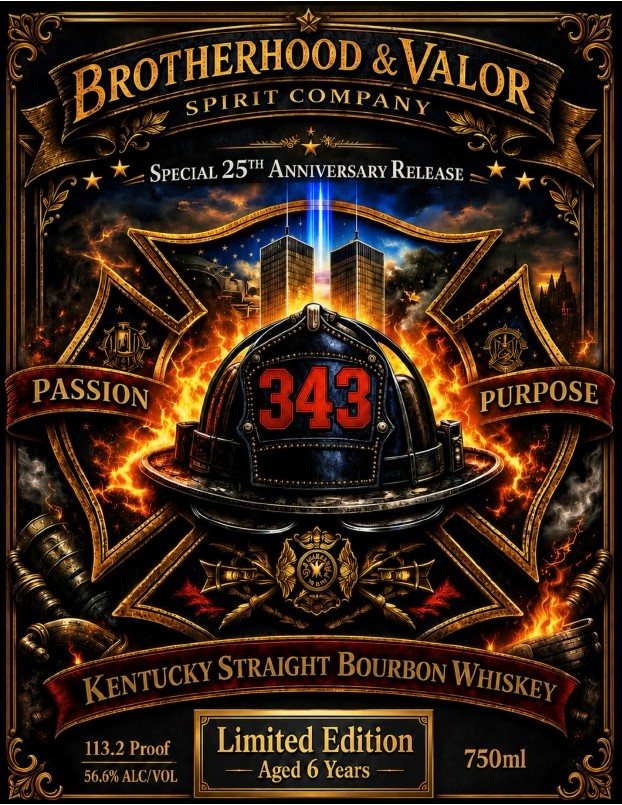

# TTB COLA Label Images - TTBID 26218001000425

**Brand Name:** BROTHERHOOD & VALOR

**Issue Date:** 08/12/2026

**Origin Code:** 22

**Product Class/Type:** 101

**Source:** [TTB Public COLA Registry](https://ttbonline.gov/colasonline/viewColaDetails.do?action=publicFormDisplay&ttbid=26218001000425)

## Label Images

### Back Label

### Label 1

## Extracted Label Text

*Text extracted via OCR - may contain errors*

**Detected Proof:** 113.2
**Detected Age:** 6 Years

### Back Label

CoMPANY
9.11 NEVER FORGET
This   special  release   CASK   STRENGTH  BOURBON
represents   strength;  honor;  valor   and  the   spirit   of
brotherhood
a balanced expression that is bold yet
approachable   Carefully   crafted   and   HAND-PICKED
from a SINGLE BARREL, this wheated kentucky mashbill
was created to have
rich and memorable character;
perfect for sipping or enjoyed in your favorite cocktail:
Produced under the direction of a Bourbon Hall of Fame
Master Distiller  and bottled  in  Bardstown; Kentucky;
every   bottle   reflects
a   commitment   to   quality   and
craftsmanship:
SERVICE FIRST_ WHISKEY SECOND
MARK & TROY
SPECIAL RELEASE
HAND-FICKED !Y
BARREL NO.
ITS FOUNDERS
CASK STRENGTH
343
fffee
LIMITED RELEASE
Distilled and Aged in Kentucky:
Bottled in Bardstown, KY by DMY Brands.
GOVERNMENT Warning: (1) Accomoing
ThE SurGFDN
GENEREL
FUUMEIT
Sshqul
ut Wain<
eEt
JEVLROGES
Dun
Pregnancy DecauSE Of The Ris <
Ginth offTctS
unsumptidm
allohoLIC BEYERNGES
FPZIRG
f
TaiVe
Halerale
Hleml
34038"44502
LAUSE HeALIH huaLEIS
BRoTHERHOOD
VALOR
SPTRIT
Ty

### Label 1

&
COM
SPECIAL 25TH ANNIVERSARY RELEASE
PASSION
3431
PURPOSE
STRAIGHT BOURBON
113.2 Proof
Limited Edition
56.6% ALC/VOL
Aged 6 Years
750m]
BROTHERHOOD
VALOR
SPTRIT
PANY
KENTUCKY _
WHISKEY
