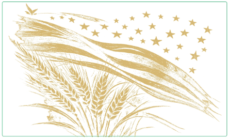
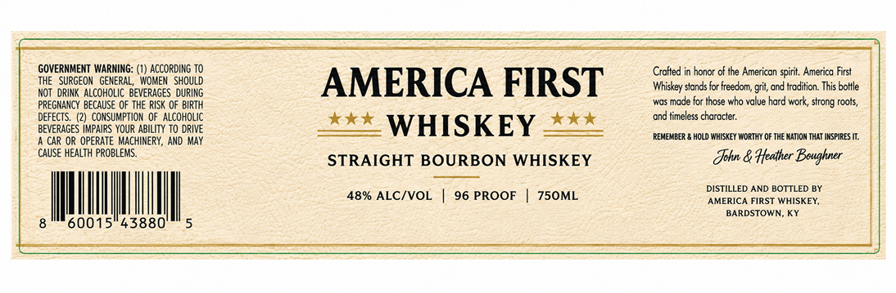

# TTB COLA Label Images - TTBID 26218001000562

**Brand Name:** AMERICA FIRST WHISKEY

**Issue Date:** 08/13/2026

**Origin Code:** 22

**Product Class/Type:** 140

**Source:** [TTB Public COLA Registry](https://ttbonline.gov/colasonline/viewColaDetails.do?action=publicFormDisplay&ttbid=26218001000562)

## Label Images

### Back Label

### Label 1

### Label 3

## Extracted Label Text

*Text extracted via OCR - may contain errors*

*2 image(s) excluded: text did not meet readability threshold*

**Detected Proof:** 96

### Label 1

GOVERNMENT WARNING:
ACCORDING TO
Cralted in
of iIne American spirit. America First
THE   SURGEOM
GENERAL,  WOMEN   ShoulD
AMERICA FIRST
Whiskey stands tor freedom; grit, and tradition. This bottle
NOT  drink ALCOHOLIC BEVERAGES  DURING
PREGNANCY BECAUSE OF ThE RISK OF BIRTH
made fcr
who value hard work, strong roots,
DEFECTS:
(2) ConsuMpTION  Of alcohOLIC
ond iimeless character:
BEVERAGES IMPAIRS YOUR ABILITY To dRIVE
WHISKEY
CAR OR OPERATE MACHINERY, AND MAy
REMEMBER & HOLD WHISAEY WYORIHY OF THE MATION THAT IRSPIRES II:
CAUSE HEALTH PROBLEMS_
STRAIGHT BOURBON WHISKEY
Tohn & Heather Beughner
DISTILLED AND BOTTLED BY
48% ALC/VOL
96 PROOF
750ML
AMERICA FIRST WHISKEY;
BARDSTOWN
60015"43880
honoi '
ttose
