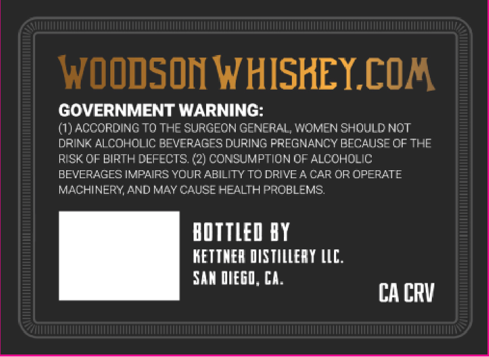
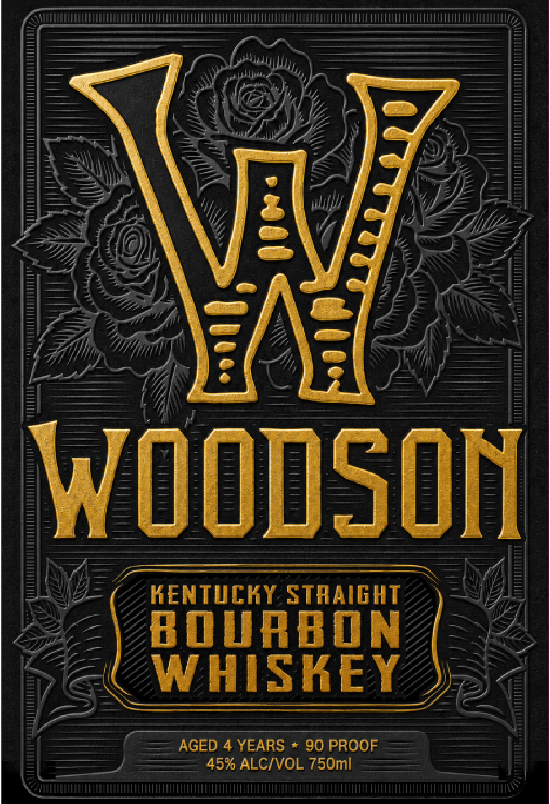

# TTB COLA Label Images - TTBID 26218001000666

**Brand Name:** WOODSON

**Issue Date:** 08/12/2026

**Origin Code:** 01

**Product Class/Type:** 101

**Source:** [TTB Public COLA Registry](https://ttbonline.gov/colasonline/viewColaDetails.do?action=publicFormDisplay&ttbid=26218001000666)

## Label Images

### Back Label

### Front Label

## Extracted Label Text

*Text extracted via OCR - may contain errors*

**Detected Proof:** 90
**Detected Age:** 4 Years

### Back Label

WOODSON WHISHEY.COM

GOVERNMENT WARNING:

(1) ACCORDING TO THE SURGEON GENERAL, WOMEN SHOULD NOT

DRINK ALCOHOLIC BEVERAGES DURING PREGNANCY BECAUSE OF THE

RISK OF BIRTH DEFECTS. (2) CONSUMPTION OF ALCOHOLIC

BEVERAGES IMPAIRS YOUR ABILITY TO DRIVE A CAR OR OPERATE

MACHINERY, AND MAY CAUSE HEALTH PROBLEMS.

BOTTLED 8Y

KETTNER OUSTILLERY LLC.

SAN DIEGO, CA.

CA CRV

### Front Label

WoodSOn
KENTVCKY StrAIGHT
B @URBON
WHISKEY
AGED 4 YEARS
90 PROOF
457 ALCIVOL 750mi
