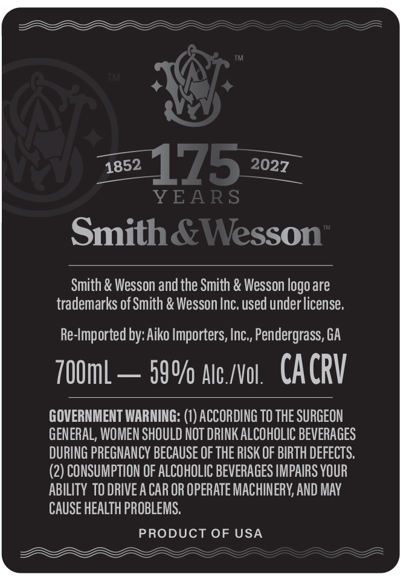
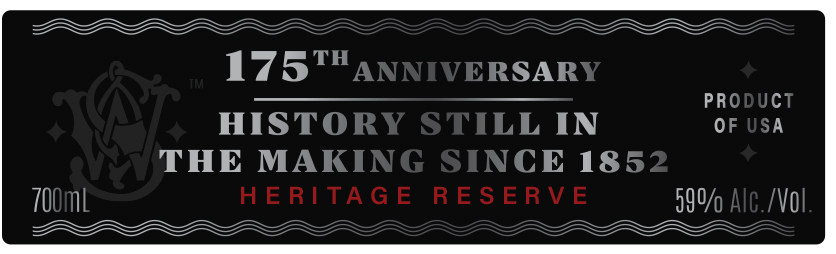

# TTB COLA Label Images - TTBID 26218001000687

**Brand Name:** SMITH & WESSON

**Issue Date:** 08/13/2026

**Origin Code:** 43

**Product Class/Type:** 140

**Source:** [TTB Public COLA Registry](https://ttbonline.gov/colasonline/viewColaDetails.do?action=publicFormDisplay&ttbid=26218001000687)

## Label Images

### Back Label

### Front Label

## Extracted Label Text

*Text extracted via OCR - may contain errors*

### Back Label

1852
175
YEARS
Smith&Wesson
Smith & Wesson and the Smith & Wesson logo are
trademarks of Smith & Wesson Inc. used under license.
Re-Imported by: Aiko Importers, Inc,, Pendergrass, GA
7OUmL
590/ Alc./Vol .
CACRV
GOVERNMENT WARNING: (I) ACCORDING TO THE SURGEON
GENERAL; WOMEN SHOULD NOT DRINK ALCOHOLIC BEVERAGES
DURING PREGNANCY BECAUSE OF THE RISK OF BIRTH DEFECTS.
(2) CONSUMPTION OF ALCOHOLIC BEVERAGES IMPAIRS VOUR
ABILITY TO DRIVE A CAR OR OPERATE MACHINERY, AND MAY
CAUSE HEALTH PROBLEMS
PRODUCT OF USA
2027

### Front Label

————a—a—-

BBA

BLY

175"

tRSAR

PRO

JCT

HISTO

sL IN

OF

SA

THE MAKI

ICE 185

700ml

9%

A

~—

HERITAGE a

—BAAA
