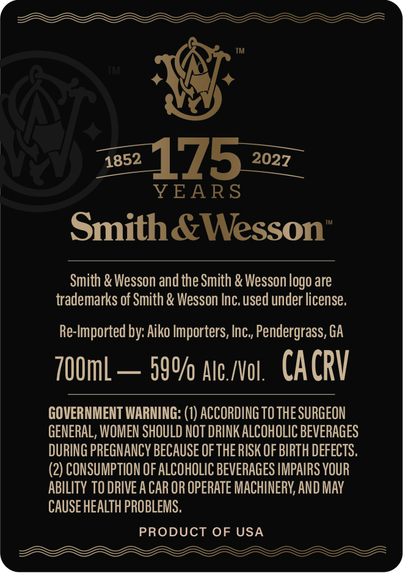
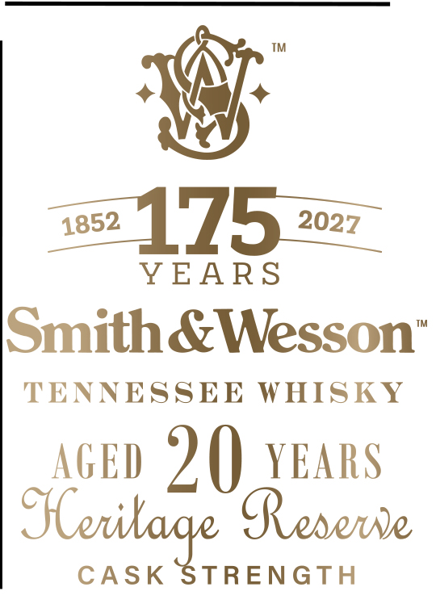

# TTB COLA Label Images - TTBID 26218001000688

**Brand Name:** SMTIH & WESSON

**Issue Date:** 08/13/2026

**Origin Code:** 43

**Product Class/Type:** 140

**Source:** [TTB Public COLA Registry](https://ttbonline.gov/colasonline/viewColaDetails.do?action=publicFormDisplay&ttbid=26218001000688)

## Label Images

### Back Label

### Front Label

## Extracted Label Text

*Text extracted via OCR - may contain errors*

**Detected Age:** 8 Years

### Back Label

l BRAAABAAFEY aaa
Mar.
wey)
YEARS
© uM
Smith &Wesson
Smith & Wesson and the Smith & Wesson logo are
trademarks of Smith & Wesson Inc. used under license.
Re-Imported by: Aiko Importers, Inc., Pendergrass, GA
700ml — 59% ate./vol, CACRV
GOVERNMENT WARNING: (1) ACCORDING TO THE SURGEON
GENERAL, WOMEN SHOULD NOT DRINK ALCOHOLIC BEVERAGES
DURING PREGNANCY BECAUSE OF THE RISK OF BIRTH DEFECTS.
(2) CONSUMPTION OF ALCOHOLIC BEVERAGES IMPAIRS YOUR
ABILITY TO DRIVE A CAR OR OPERATE MACHINERY, AND MAY
CAUSE HEALTH PROBLEMS.
PRODUCT OF USA

### Front Label

8
YEARS
Smith &Wesson’
TENNESSEE WHISKY
AGED 2 () YEARS
Sberilage R erowe
CASK STRENGTH
