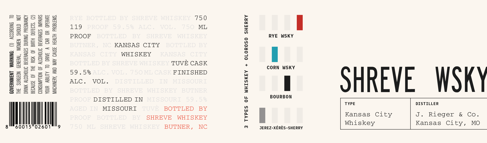

# TTB COLA Label Images - TTBID 26218001000692

**Brand Name:** SHREVE WHISKEY

**Issue Date:** 09/01/2026

**Origin Code:** 35

**Product Class/Type:** 140

**Source:** [TTB Public COLA Registry](https://ttbonline.gov/colasonline/viewColaDetails.do?action=publicFormDisplay&ttbid=26218001000692)

## Label Images

### Label 1

## Extracted Label Text

*Text extracted via OCR - may contain errors*

**Detected Proof:** 119

### Label 1

2
=
3
RYE
BOTTLED
BY
SHREVE
WHTSKEY
75 0
1247448
119
PROOF
5,9
5 %
ALC
VOL
7,50
ML
1
5
4
2
PROOF
BOTTLED
BY
SHREVE
WHTSKEY
RYE
WSKY
0i
3
BUTNER ,
NC KANSAS CITY
BOTTLED BY
5
3
KANTSAS
CITY
WHISKEY
KANSAS
CITY
1
I!
2
8i8
BOTTLED BY SHREVE WHTSKEY TUVE CASK
2
5
2
CORN
WSKY
1
2
59
5% ALC
VOL
750 ML CASK FINISHED
Il
5
8
Hi
ALC .
VOL
DISTILLED
IIT
MIS SOURI
1
SHREVE
WSK
2
3
2
BOTTLED
BY
SHREVE
WHI SKEY
BUTNER
BOURBON
PROOF DISTILLED IN
MIS SOURI
5,9
5 %
5
TYPE
DISTILLER
AGED IIT
MISSOURI
TUVE
BOTTLED
BY
PROOF
BOTTLED
BY
SHREVE
WHISKEY
2
Kansas
City
J.
Rieger
&
Co _
Whiskey
Kansas
City,
MO
60015
02601
7,5 0
ML
SHREVE
WHI SKEY
BUTNER ,
NC
0
JEREZ-XERES-SHERRY
