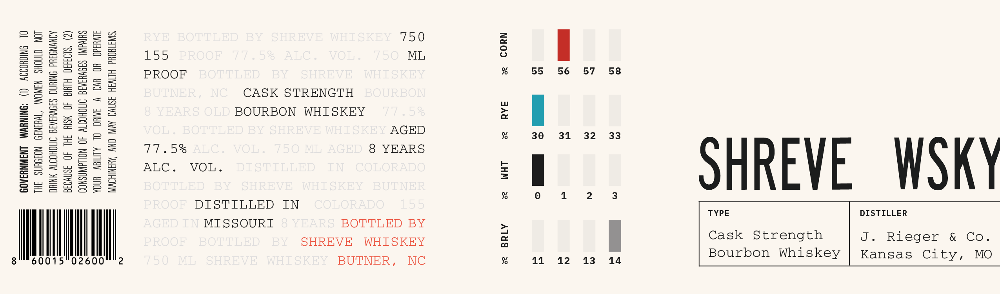

# TTB COLA Label Images - TTBID 26218001000693

**Brand Name:** SHREVE WHISKEY

**Issue Date:** 08/18/2026

**Origin Code:** 35

**Product Class/Type:** 141

**Source:** [TTB Public COLA Registry](https://ttbonline.gov/colasonline/viewColaDetails.do?action=publicFormDisplay&ttbid=26218001000693)

## Label Images

### Label 1

## Extracted Label Text

*Text extracted via OCR - may contain errors*

**Detected Proof:** 155
**Detected Age:** 8 Years

### Label 1

2
=
3
RYE
BOTTLED
BY
SHREVE
WHTSKEY
75 0
841444
155
PROOF
7.7
5 %
ALC
VOL
7,50
ML
2
1
4
5
PROOF
BOTTLED
BY
SHREVE
WHTSKEY
9
55
56
57
58
0i
3
2
BUTNER ,
NC
CASK STRENGTH
BOURBONT
1
5
1
8 YEAR8 OLD BOURBON
WHISKEY
77 , 5%
0
I
2
2
3
VOL
BOTTLED BY SHREVE WHISKEY AGED
9
30
31
32
33
2
5
2
1
77 . 5%
ALC
VOL
750 ML AGED 8
YEARS
Il
5
8
Hi
ALC _
VOL _
DISTILLED
IIT
COLORADO
1
SHREVE
WSK
2
3
2
BOTTLED
BY
SHREVE
WHI SKEY
BUTNER
9
PROOF
DISTILLED
IN
COLORADO
15 5
TYPE
DISTILLER
AGED IN MISSOURI
8 YEARS BOTTLED BY
PROOF
BOTTLED
BY
SHREVE
WHISKEY
1
Cask
Strength
J .
Rieger
&
Co _
Bourbon Whiskey
Kansas City,
MO
60015
02600
2
7,5 0
ML
SHREVE
WHI SKEY
BUTNER ,
NC
9
11
12
13
14
