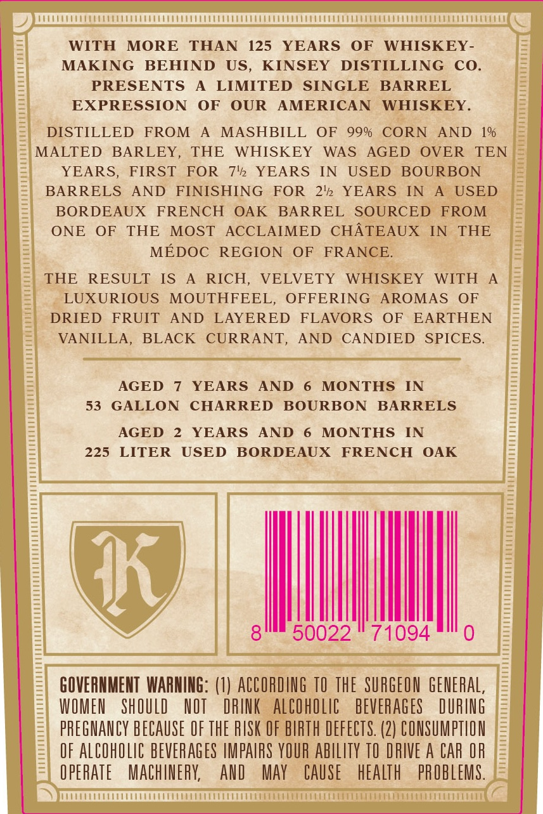
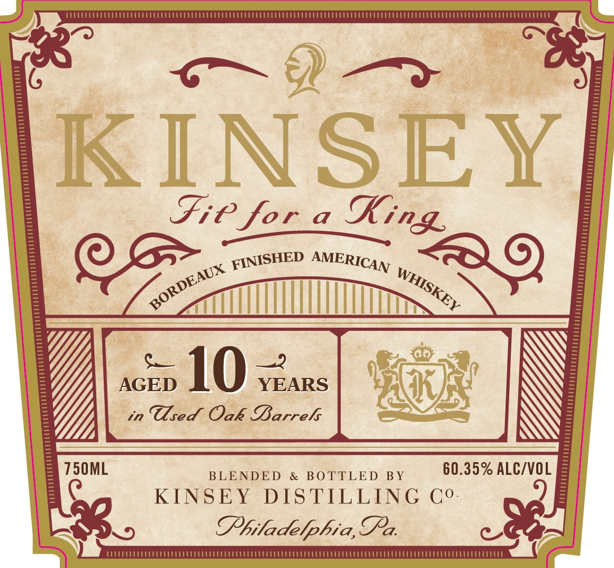
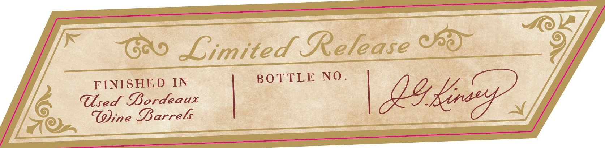

# TTB COLA Label Images - TTBID 26219001000046

**Brand Name:** KINSEY

**Issue Date:** 08/21/2026

**Origin Code:** 39

**Product Class/Type:** 140

**Source:** [TTB Public COLA Registry](https://ttbonline.gov/colasonline/viewColaDetails.do?action=publicFormDisplay&ttbid=26219001000046)

## Label Images

### Back Label

### Front Label

### Label 2

## Extracted Label Text

*Text extracted via OCR - may contain errors*

**Detected Proof:** 99
**Detected Age:** 12 Years

### Back Label

WITH
MORE
THAN
125
YEARS
OF
WHISKEY -
MAKING
BEHIND
US_
KINSEY
DISTILLING
Co_
PRESENTS
LIMITED
SINGLE
BARREL
EXPRESSION
OF
OUR
AMERICAN
WHISKEY.
DISTILLED
FROM
MASHBILL
OF
99%
CORN
AND
1%
MALTED
BARLEY,
THE
WHISKEY
WAS
AGED
OVER
TEN
YEARS;
FIRST
FOR
7412
YEARS
IN
USED
BOURBON
BARRELS
AND
FINISHING
FOR
2'12
YEARS
IN
USED
BORDEAUX
FRENCH
OAK
BARREL
SOURCED
FROM
ONE
OF
THE
MOST
AcCLAIMED
CHATEAUX
IN
THE
MEDOC
REGION
OF
FRANCE:
THE
RESULT
IS
RICH,
VELVETY
WHISKEY
WITH
LUXURIOUS
MOUTHFEEL,
OFFERING
AROMAS
OF
DRIED
FRUIT
AND
LAYERED
FLAVORS
OF
EARTHEN
VANILLA,
BLACK
CURRANT,
AND
CANDIED
SPICES_
AGED
YEARS
AND
MONTHS
IN
53
GALLON
CHARRED
BOURBON
BARRELS
AGED
YEARS
AND
MONTHS
IN
225
LITER
USED
BORDEAUX
FRENCH
OAK
I
8
50022
71094
GOVERNMENT WARNING: (1) ACCORDING TO The  SURGEON GeNERAL;
WOMEU
ShOULD
NOT
DRIK
alCohOlic
BEVERAGES
DURING
PREGMANCY BECAUSe OF ThE RISK OF BIRTH DEFECTS. (2) CONSUMPTLON
OF ALCOhOLIC BEVERAGES IMpAIRS YOUR AbILITY TO DRIVE A CAR OR
O PERATE
MAChINERK
And
May
CAUSe
heAlth
PROBLEMS.

### Front Label

KINSEY
Fie for
a
10
2
AGED
YEARS
in
Tsed Oak Sarrek
750ML
BLENDED
&
BO TTLED
BY
60.35% ALCIVOL
KINSEY
DIS TILLING
Co.
Shiladelphia,TPa:
King
FINISHED
AMERICAN
BORDEAUX
WHISKEY

### Label 2

Gro Limited Fare Os

Ay

FINISHED IN BOTTLE NO.

sed Dordeaux
Wine Barrels
